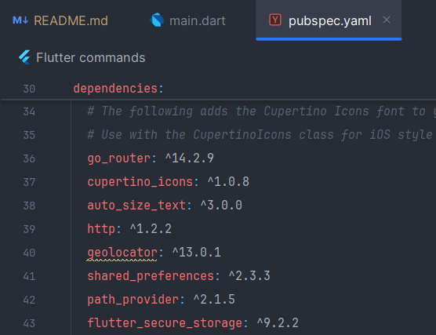
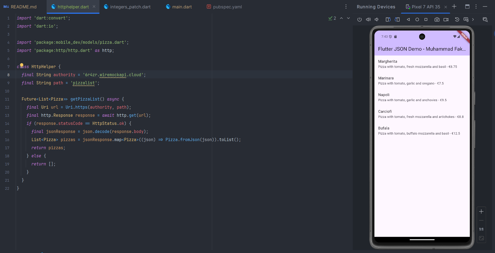
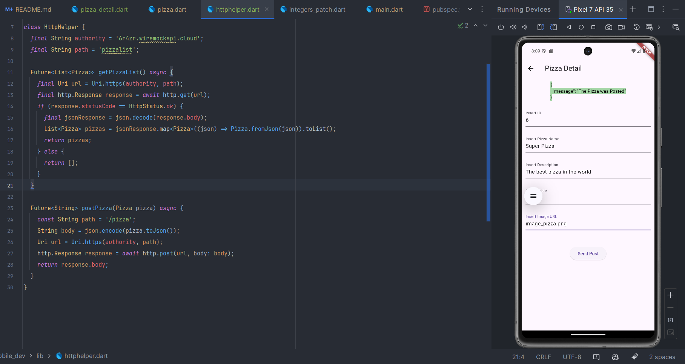

``` text
Nama   : Muhammad Fakhruddin Arif
NIM    : 2241720030
Kelas  : TI-3C
```
### Praktikum 1: Designing an HTTP client and getting data
#### 1. Install package http

#### 2. Buat file httphelper.dart
```dart
import 'dart:convert';
import 'dart:io';

import 'package:mobile_dev/models/pizza.dart';
import 'package:http/http.dart' as http;

class HttpHelper {
  final String authority = 'https://6r4zr.wiremockapi.cloud/';
  final String path = 'pizzalist';

  Future<List<Pizza>> getPizzaList() async {
    final Uri url = Uri.https(authority, path);
    final http.Response response = await http.get(url);
    if (response.statusCode == HttpStatus.ok) {
      final jsonResponse = json.decode(response.body);
      List<Pizza> pizzas = jsonResponse.map<Pizza>((json) => Pizza.fromJson(json)).toList();
      return pizzas;
    } else {
      return [];
    }
  }
}
```

#### 3. Buat metode callPizzas() pada main.dart
```dart
Future<List<Pizza>> callPizzas() async {
    HttpHelper httpHelper = HttpHelper();
    List<Pizza> pizzas = await httpHelper.getPizzaList();
    return pizzas;
  }
```
#### 4. Buat FutureBuilder pada main.dart
``` dart
class _MyHomePageState extends State<MyHomePage> {
  int _counter = 0;

  void _incrementCounter() {
    setState(() {
      // This call to setState tells the Flutter framework that something has
      // changed in this State, which causes it to rerun the build method below
      // so that the display can reflect the updated values. If we changed
      // _counter without calling setState(), then the build method would not be
      // called again, and so nothing would appear to happen.
      _counter++;
    });
  }

  @override
  Widget build(BuildContext context) {
    // This method is rerun every time setState is called, for instance as done
    // by the _incrementCounter method above.
    //
    // The Flutter framework has been optimized to make rerunning build methods
    // fast, so that you can just rebuild anything that needs updating rather
    // than having to individually change instances of widgets.
    return Scaffold(
      appBar: AppBar(
        // TRY THIS: Try changing the color here to a specific color (to
        // Colors.amber, perhaps?) and trigger a hot reload to see the AppBar
        // change color while the other colors stay the same.
        backgroundColor: Theme.of(context).colorScheme.inversePrimary,
        // Here we take the value from the MyHomePage object that was created by
        // the App.build method, and use it to set our appbar title.
        title: Text(widget.title),
      ),
      body: FutureBuilder(
          future: callPizzas(),
          builder: (BuildContext context, AsyncSnapshot<List<Pizza>> snapshot) {
            if (snapshot.hasError) {
              return const Text('Something went wrong');
            }
            if (!snapshot.hasData) {
              return const Center(child: CircularProgressIndicator());
            }
            return ListView.builder(
              itemCount: (snapshot.data == null) ? 0 : snapshot.data!.length,
              itemBuilder: (BuildContext context, int index) {
                return ListTile(
                  title: Text(snapshot.data![index].pizzaName),
                  subtitle: Text(snapshot.data![index].description + ' - €' + snapshot.data![index].price.toString()),
                );
              },
            );
          },
      ) // This trailing comma makes auto-formatting nicer for build methods.
    );
  }

  Future<List<Pizza>> callPizzas() async {
    HttpHelper httpHelper = HttpHelper();
    List<Pizza> pizzas = await httpHelper.getPizzaList();
    return pizzas;
  }
}
```

#### 5. Menjalankan Aplikasi


### Praktikum 2: POST-ing Data
#### 1. Metode postPizza() pada httphelper.dart
```dart
Future<String> postPizza(Pizza pizza) async {
    const String path = '/pizza';
    String body = json.encode(pizza.toJson());
    Uri url = Uri.https(authority, path);
    http.Response response = await http.post(url, body: body);
    return response.body;
  }
```
#### 2. Buat file pizza detail.dart
```dart
import 'package:flutter/material.dart';
import 'package:mobile_dev/httphelper.dart';
import 'package:mobile_dev/models/pizza.dart';

class PizzaDetailScreen extends StatefulWidget {
  const PizzaDetailScreen({Key? key}) : super(key: key);

  @override
  _PizzaDetailScreenState createState() => _PizzaDetailScreenState();
}

class _PizzaDetailScreenState extends State<PizzaDetailScreen> {
  final TextEditingController _txtId = TextEditingController();
  final TextEditingController _txtName = TextEditingController();
  final TextEditingController _txtDescription = TextEditingController();
  final TextEditingController _txtPrice = TextEditingController();
  final TextEditingController _txtImageUrl = TextEditingController();

  String operationResult = '';

  @override
  void dispose() {
    _txtId.dispose();
    _txtName.dispose();
    _txtDescription.dispose();
    _txtPrice.dispose();
    _txtImageUrl.dispose();
    super.dispose();
  }

  @override
  Widget build(BuildContext context) {
    return Scaffold(
      appBar: AppBar(
        title: const Text('Pizza Detail'),
      ),
      body: Padding(
        padding: const EdgeInsets.all(12.0),
        child: SingleChildScrollView(
          child: Column(
            children: [
              Text(operationResult, style: TextStyle(backgroundColor: Colors.green[200], color: Colors.black),),
              const SizedBox(height: 24),
              _textField('Insert ID', _txtId),
              _textField('Insert Pizza Name', _txtName),
              _textField('Insert Description', _txtDescription),
              _textField('Insert Price', _txtPrice),
              _textField('Insert Image URL', _txtImageUrl),
              const SizedBox(height: 24),
              ElevatedButton(
                  onPressed: () {
                    postPizza();
                  },
                  child: const Text('Send Post')
              )
            ],
          ),
        ),
      ),
    );
  }

  Future postPizza() async {
    HttpHelper helper = HttpHelper();
    Pizza pizza = Pizza(
      id: int.parse(_txtId.text),
      pizzaName: _txtName.text,
      description: _txtDescription.text,
      price: double.parse(_txtPrice.text),
      imageUrl: _txtImageUrl.text,
    );
    String result = await helper.postPizza(pizza);
    setState(() {
      operationResult = result;
    });
  }

  Column _textField(String label, TextEditingController controller) {
    return Column(
      children: [
        TextField(
          controller: controller,
          decoration: InputDecoration(
            labelText: label,
          ),
        ),
        const SizedBox(height: 24),
      ],
    );
  }
}
```
#### 3. Tambah floating action button pada main.dart
```dart
floatingActionButton: FloatingActionButton(
        child: const Icon(Icons.add),
          onPressed: () {
            Navigator.push(
              context,
              MaterialPageRoute(builder: (context) => PizzaDetailScreen()),
            );
          }
      ),
```
#### 4. Menjalankan Aplikasi


### Praktikum 3: PUT-ing Data