``` text
Nama   : Muhammad Fakhruddin Arif
NIM    : 2241720030
Kelas  : TI-3C
```
### Praktikum 1
#### 1. Membuat project Flutter Langkah 1
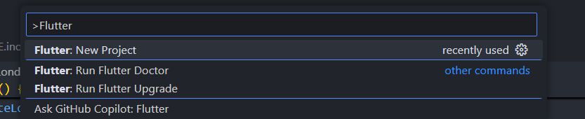
``` text
Pada langkah pertama ini, saya membuat project flutter menggunakan vscode dengan ketik ctrl + shift + p.
```
#### 2. Membuat project Flutter Langkah 2
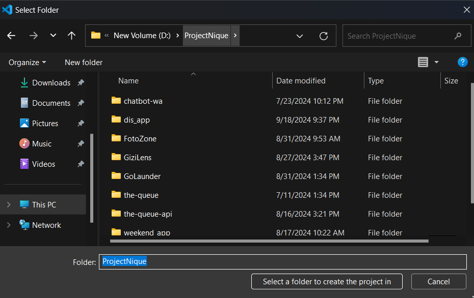
``` text
Pada langkah kedua ini, saya memilih folder untuk menyimpan project flutter yang akan saya buat.
```
#### 3. Membuat project Flutter Langkah 3
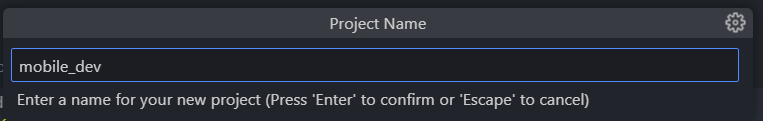
``` text
Pada langkah ketiga ini, saya memberi nama project flutter yang akan saya buat dengan lowercase.
```
#### 4. Membuat project Flutter Langkah 4
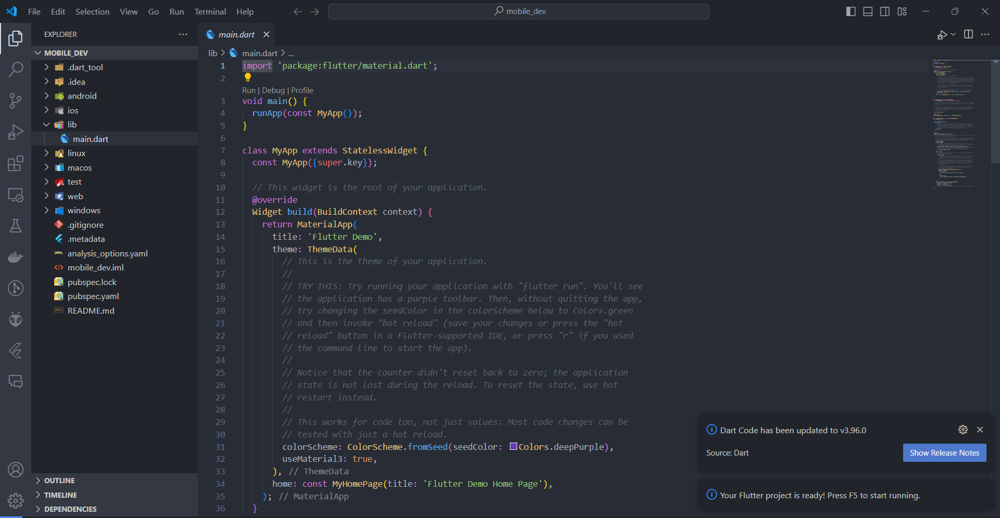
``` text
Pada langkah keempat ini, Project berhasil dibuat.
```
### Praktikum 2
#### 1. Membuat repository baru
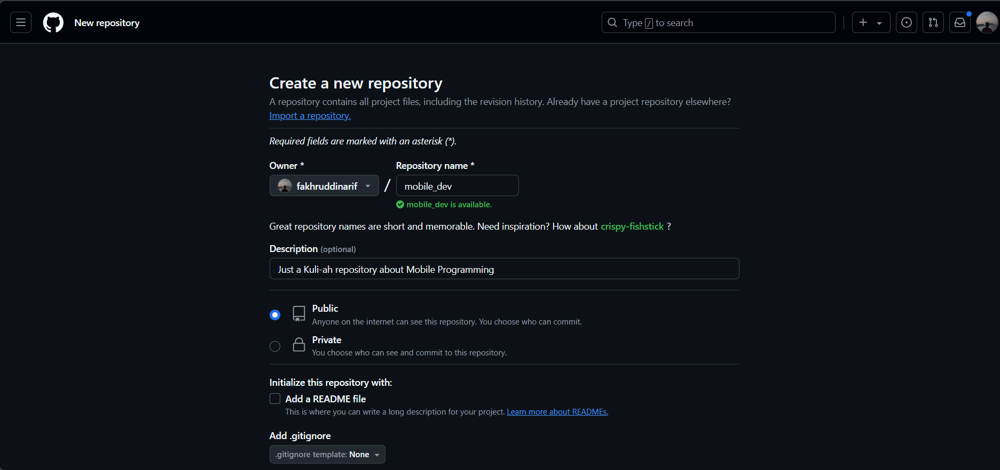
```text
Pada praktikum 2 ini, saya membuat repository baru dengan memberi nama.
```
#### 2. Tampilan awal repository
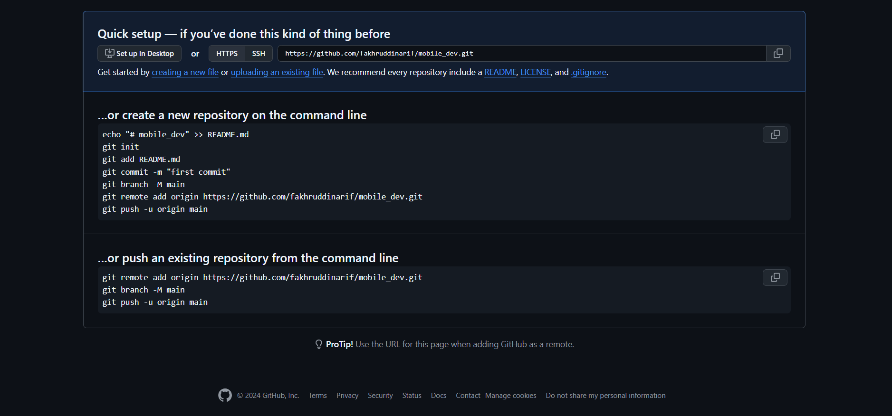
```text
Pada tampilan awal repository ini, saya mendapatkan link repository yang telah saya buat.
```
#### 3. Membuat git init
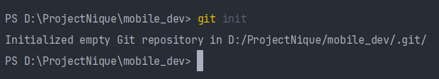
```text
Pada langkah ini, saya membuat git init pada project flutter yang telah saya buat.
```
#### 4. Membuat git add
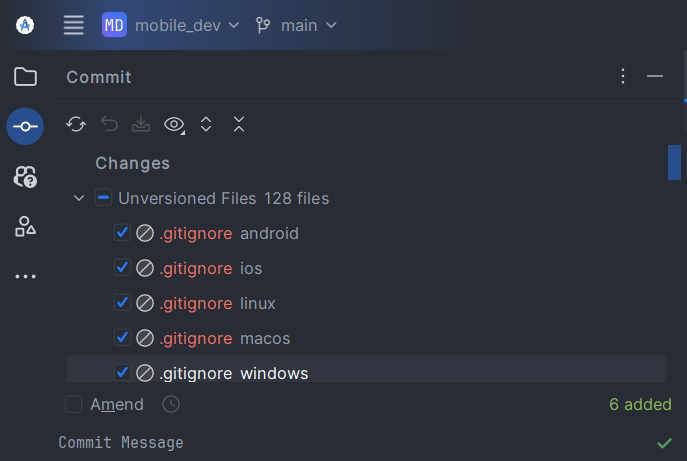
```text
Pada langkah ini, saya membuat git add pada project flutter yang telah saya buat.
```
#### 5. Membuat git commit
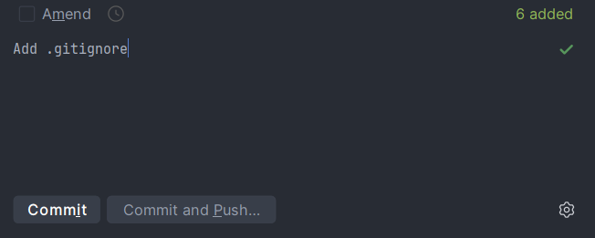
```text
Pada langkah ini, saya membuat git commit pada project flutter yang telah saya buat.
```
#### 6. Push ke repository
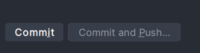
```text
Pada langkah ini, saya membuat push ke repository pada project flutter yang telah saya buat.
```
#### 7 dan 8. Tambahkan remote repository ke local repository
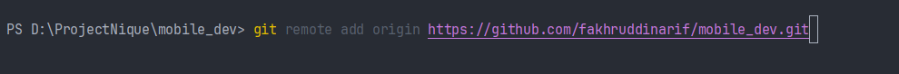
```text
Pada langkah ini, saya menambahkan remote repository ke local repository pada project flutter yang telah saya buat.
```
#### 9. Push .gitignore
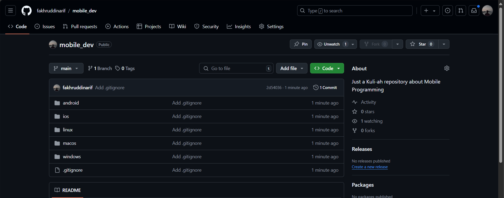
```text
Pada langkah ini, saya membuat push .gitignore pada project flutter yang telah saya buat.
```
#### 10. Push project flutter
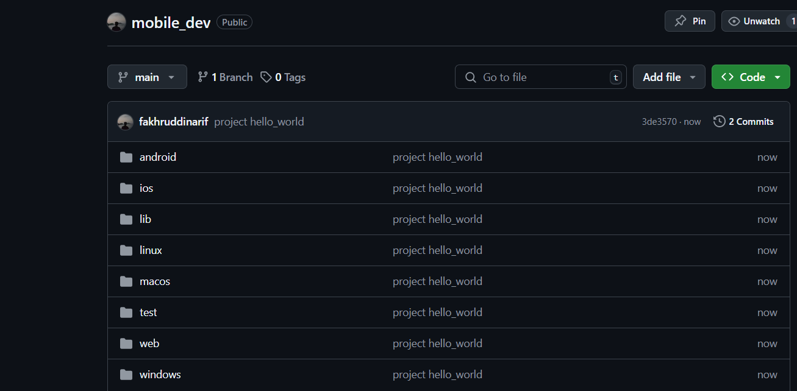
```text
Pada langkah ini, saya membuat push project flutter yang telah saya buat.
```
#### 11. Run project flutter
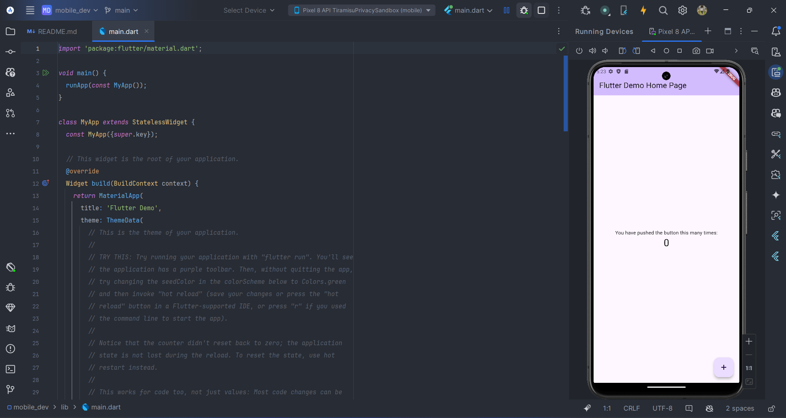
```text
Pada langkah ini, saya membuat run project flutter yang telah saya buat.
```
#### 12. Membuat teks dengan nama lengkap
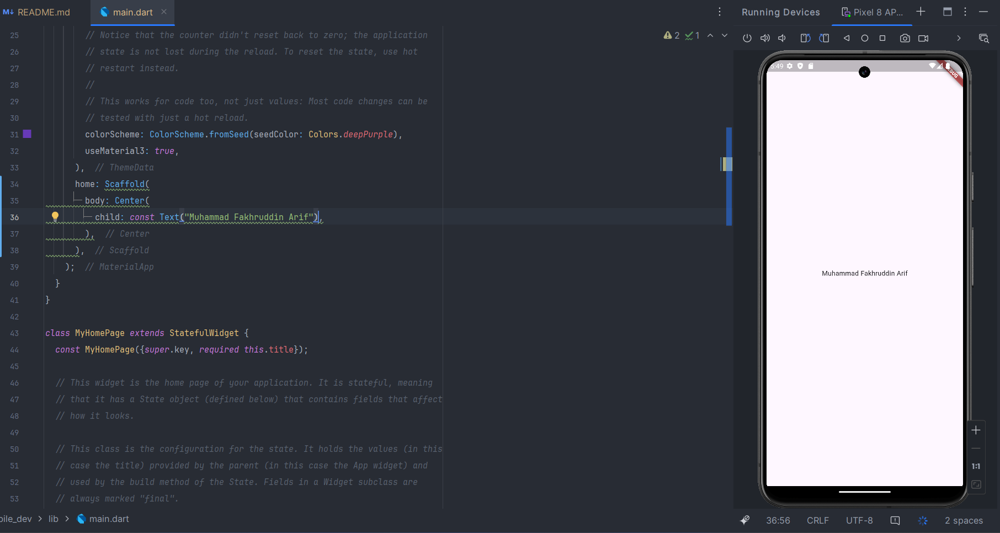
```text
Pada praktikum akhir ini, saya membuat teks dengan nama lengkap saya.
```

### Praktikum 3
#### 1. Membuat text widget
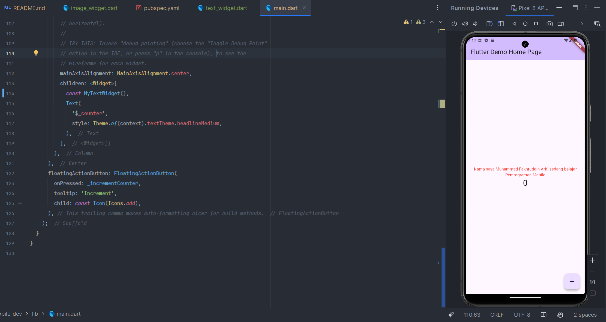
```text
Pada praktikum 3 ini, saya membuat text widget dengan menggunakan widget Text yang berisi nama lengkap saya.
```
#### 2. Image Widget
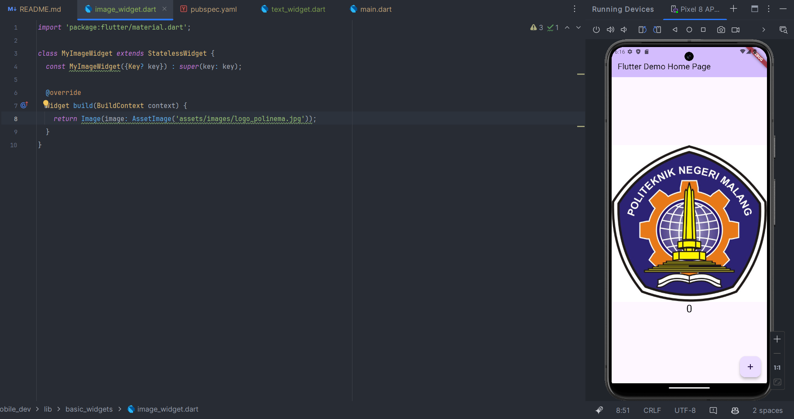
```text
Pada praktikum 3 ini, saya membuat image widget dengan menggunakan widget Image.
```
### Praktikum 4
#### 1. Cupertino Button dan Loading Bar
``` dart
import 'package:flutter/cupertino.dart';
import 'package:flutter/material.dart';

class MyLoadingCupertino extends StatelessWidget {
  const MyLoadingCupertino({Key? key}) : super(key: key);

  @override
  Widget build(BuildContext context) {
    return MaterialApp(
      home: Container(
        margin: const EdgeInsets.only(top: 30),
        color: Colors.white,
        child: Column(
          children: <Widget>[
            CupertinoButton(
              child: const Text("Contoh button"),
              onPressed: () {},
            ),
            const CupertinoActivityIndicator(),
          ],
        ),
      ),
    );
  }
}
```
#### 2. Floating Action Button (FAB)
``` dart
import 'package:flutter/material.dart';

class MyFabWidget extends StatelessWidget {
  const MyFabWidget({Key? key}) : super(key: key);

  @override
  Widget build(BuildContext context) {
    return Scaffold(
      floatingActionButton: FloatingActionButton(
        onPressed: () {
          // Add your onPressed code here!
        },
        child: const Icon(Icons.thumb_up),
        backgroundColor: Colors.pink,
      ),
    );
  }
}
```
#### 3. Scaffold Widget
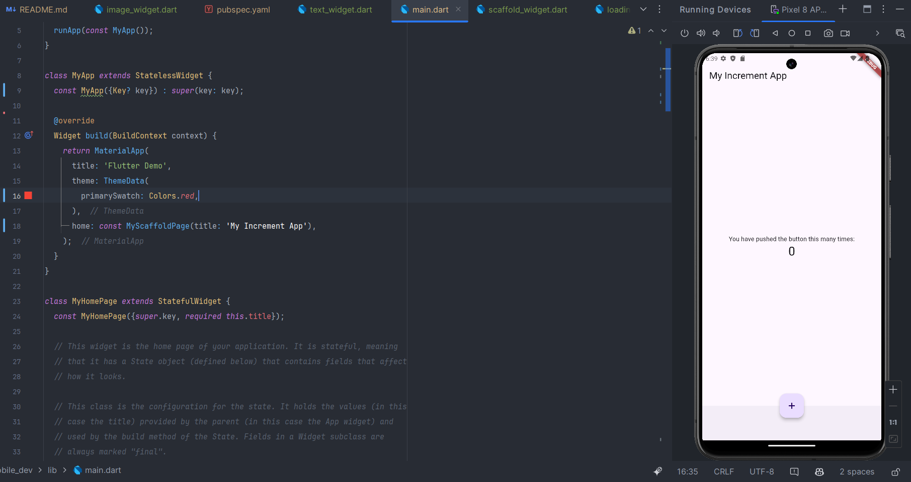
```text
Pada praktikum 4 ini, saya membuat scaffold widget dengan menggunakan widget Scaffold yang berisi appbar, body, dan floating action button.
```
#### 4. Dialog Widget
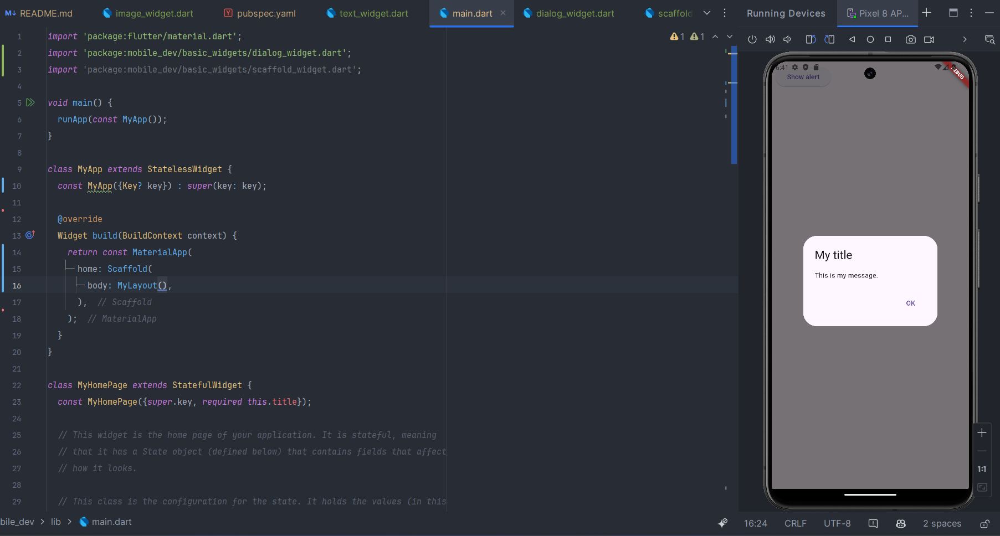
```text
Pada praktikum 4 ini, saya membuat dialog widget dengan menggunakan widget AlertDialog yang berisi judul, konten, dan action.
```
#### 5. Input dan Selection Widget

```text
Pada praktikum 4 ini, saya membuat input dan selection widget dengan menggunakan widget TextField.
```
#### 6. Date and Time Pickers
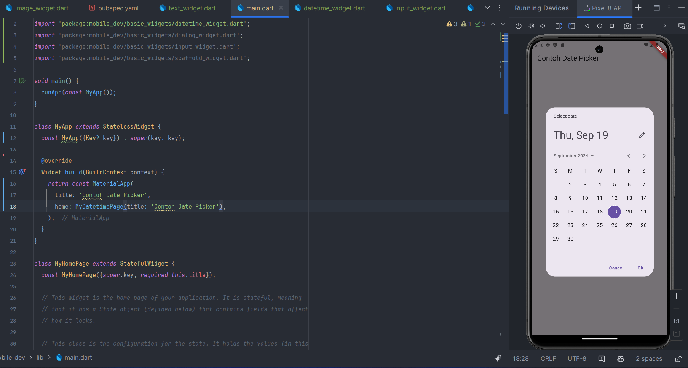
```text
Pada praktikum 4 ini, saya membuat date and time pickers widget dengan menggunakan widget DateTimePicker.
```