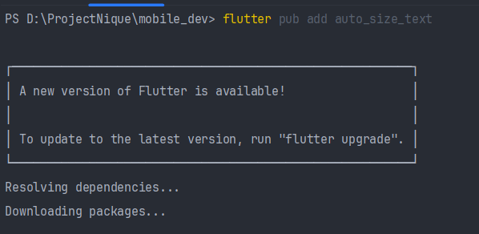
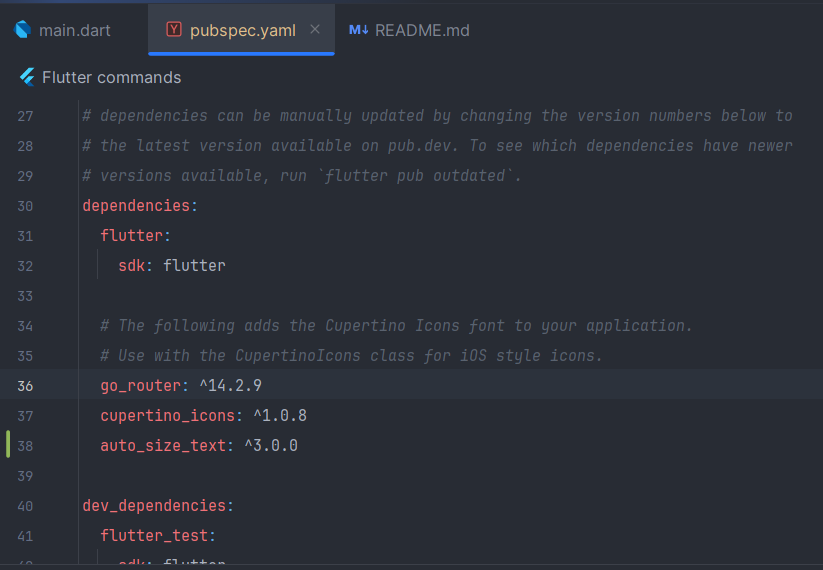
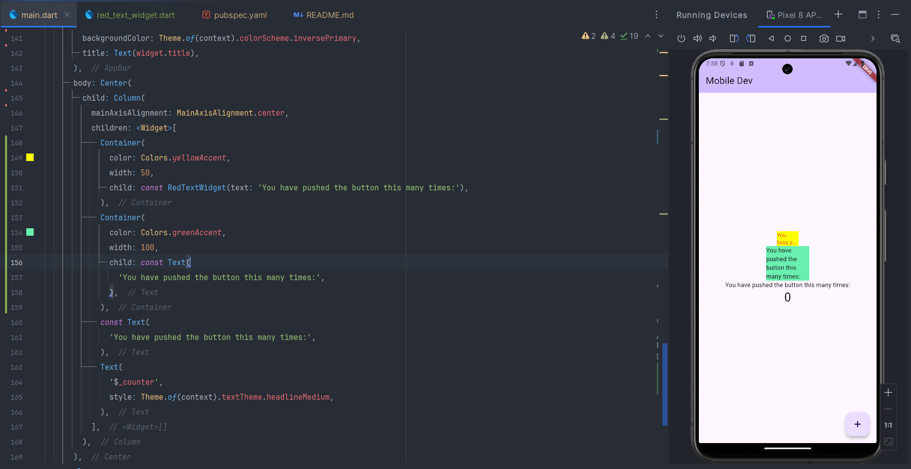

``` text
Nama   : Muhammad Fakhruddin Arif
NIM    : 2241720030
Kelas  : TI-3C
```
### Praktikum 
#### 1. Menambahkan plugin
Berikut adalah cara menambahkan plugin pada flutter:


Dan ini adalah hasilnya pada pubspec.yaml:



Penjelasan:
``` text
Pada langkah ini kita menambahkan plugin auto_size_text pada file pubspec.yaml.
Kemudian kita menjalankan perintah flutter pub get untuk menginstal plugin auto_size_text.
plugin auto_size_text digunakan untuk membuat text yang bisa menyesuaikan ukuran fontnya.
```

#### 2. Buat file red_text_widget.dart
Berikut adalah kode program yang ada pada file red_text_widget.dart:
``` dart
import 'package:flutter/material.dart';

class RedTextWidget extends StatelessWidget {
  const RedTextWidget({Key? key}) : super(key: key);

  @override
  Widget build(BuildContext context) {
    return Container();
  }
}
```
Penjelasan:
``` text
Pada langkah ini kita membuat file red_text_widget.dart yang berisi class RedTextWidget yang merupakan stateless widget.
Kemudian kita mengembalikan widget Container() pada method build().
```
#### 3. Tambah widget AutoSizeText
Berikut adalah kode program yang ada pada file red_text_widget.dart:
``` dart
import 'package:auto_size_text/auto_size_text.dart';
import 'package:flutter/material.dart';

class RedTextWidget extends StatelessWidget {
  const RedTextWidget({Key? key}) : super(key: key);

  @override
  Widget build(BuildContext context) {
    return AutoSizeText(
      "Red Text",
      style: const TextStyle(color: Colors.red, fontSize: 14),
      maxLines: 2,
      overflow: TextOverflow.ellipsis,
    );
  }
}
```
Penjelasan:
``` text
Pada langkah ini kita mengubah widget Container() menjadi AutoSizeText().
Kemudian kita menambahkan parameter text pada constructor.
Kemudian kita mengembalikan widget AutoSizeText() dengan parameter text yang diterima dari constructor.
Kemudian kita menambahkan style pada AutoSizeText() dengan warna merah dan ukuran font 14.
Kemudian kita menambahkan maxLines: 2 dan overflow: TextOverflow.ellipsis.
```
#### 4. Buat variabel text dan parameter di contructor
Berikut adalah kode program yang ada pada file red_text_widget.dart:
``` dart
import 'package:auto_size_text/auto_size_text.dart';
import 'package:flutter/material.dart';

class RedTextWidget extends StatelessWidget {
  final String text;

  const RedTextWidget({Key? key, required this.text}) : super(key: key);

  @override
  Widget build(BuildContext context) {
    return AutoSizeText(
      text,
      style: const TextStyle(color: Colors.red, fontSize: 14),
      maxLines: 2,
      overflow: TextOverflow.ellipsis,
    );
  }
}
```
Penjelasan:
``` text
Pada langkah ini kita menambahkan variabel text bertipe String pada class RedTextWidget.
Kemudian kita menambahkan parameter text pada constructor.
Kemudian kita mengubah parameter text menjadi required.
Dan parameter text tersebut kita gunakan pada AutoSizeText().
```
#### 5. Tambah widget di main.dart
Berikut adalah hasil dari penambahan widget di main.dart:



Penjelasan:
``` text
Perbedaan pada widget AutoSizeText() dengan Text() adalah AutoSizeText() bisa menyesuaikan ukuran fontnya,
sedangkan Text() tidak bisa menyesuaikan ukuran fontnya sesuai ukuran dari container.
```

### Tugas
#### Jelaskan maksud dari tiap parameter yang ada di dalam plugin auto_size_text berdasarkan tautan pada dokumentasi 
Berikut adalah penjelasan dari tiap parameter yang ada di dalam plugin auto_size_text berdasarkan tautan pada dokumentasi:
``` text
1. group: String
   - Maksud dari parameter group adalah untuk mengelompokkan AutoSizeText yang memiliki group yang sama.
   - Jika AutoSizeText memiliki group yang sama, maka AutoSizeText tersebut akan memiliki ukuran font yang sama.
   - Jika AutoSizeText memiliki group yang berbeda, maka AutoSizeText tersebut akan memiliki ukuran font yang berbeda.
2. maxLines: int
   - Maksud dari parameter maxLines adalah untuk menentukan jumlah baris maksimal yang bisa ditampilkan oleh AutoSizeText.
   - Jika AutoSizeText memiliki jumlah baris yang lebih dari maxLines, maka AutoSizeText akan menampilkan overflow.
3. minFontSize: double
    - Maksud dari parameter minFontSize adalah untuk menentukan ukuran font minimal yang bisa ditampilkan oleh AutoSizeText.
    - Jika AutoSizeText memiliki ukuran font yang lebih kecil dari minFontSize, maka AutoSizeText akan menampilkan ukuran font minimal.
4. maxFontSize: double
    - Maksud dari parameter maxFontSize adalah untuk menentukan ukuran font maksimal yang bisa ditampilkan oleh AutoSizeText.
    - Jika AutoSizeText memiliki ukuran font yang lebih besar dari maxFontSize, maka AutoSizeText akan menampilkan ukuran font maksimal.
5. presetFontSizes: List<double>
    - Maksud dari parameter presetFont
    - Sizes adalah untuk menentukan ukuran font yang bisa ditampilkan oleh AutoSizeText.
    - Jika AutoSizeText memiliki ukuran font yang lebih dari presetFontSizes, maka AutoSizeText akan menampilkan overflow.
6. stepGranularity: double
    - Maksud dari parameter stepGranularity adalah untuk menentukan ukuran font yang bisa ditampilkan oleh AutoSizeText.
    - Jika AutoSizeText memiliki ukuran font yang lebih dari stepGranularity, maka AutoSizeText akan menampilkan overflow.
7. style: TextStyle
    - Maksud dari parameter style adalah untuk menentukan style dari AutoSizeText.
    - Jika AutoSizeText memiliki style yang berbeda, maka AutoSizeText akan menampilkan style yang berbeda.
8. strutStyle: StrutStyle
    - Maksud dari parameter strutStyle adalah untuk menentukan strutStyle dari AutoSizeText.
    - Jika AutoSizeText memiliki strutStyle yang berbeda, maka AutoSizeText akan menampilkan strutStyle yang berbeda.
9. presetFontSizes: List<double>
    - Maksud dari parameter presetFontSizes adalah untuk menentukan ukuran font yang bisa ditampilkan oleh AutoSizeText.
    - Jika AutoSizeText memiliki ukuran font yang lebih dari presetFontSizes, maka AutoSizeText akan menampilkan overflow.
10. locale: Locale
    - Maksud dari parameter locale adalah untuk menentukan locale dari AutoSizeText.
    - Jika AutoSizeText memiliki locale yang berbeda, maka AutoSizeText akan menampilkan locale yang berbeda.
11. softWrap: bool
    - Maksud dari parameter softWrap adalah untuk menentukan apakah AutoSizeText bisa melakukan wrap atau tidak.
    - Jika AutoSizeText memiliki softWrap yang true, maka AutoSizeText akan melakukan wrap.
12 wrapWords: bool
    - Maksud dari parameter wrapWords adalah untuk menentukan apakah AutoSizeText bisa melakukan wrap pada kata atau tidak.
    - Jika AutoSizeText memiliki wrapWords yang true, maka AutoSizeText akan melakukan wrap pada kata.
13. overflow: TextOverflow
    - Maksud dari parameter overflow adalah untuk menentukan overflow dari AutoSizeText.
    - Jika AutoSizeText memiliki overflow yang berbeda, maka AutoSizeText akan menampilkan overflow yang berbeda.
14. overflowReplacement: Widget
    - Maksud dari parameter overflowReplacement adalah untuk menentukan widget yang akan ditampilkan jika AutoSizeText memiliki overflow.
    - Jika AutoSizeText memiliki overflow, maka AutoSizeText akan menampilkan overflowReplacement.
15. textScaleFactor: double
    - Maksud dari parameter textScaleFactor adalah untuk menentukan faktor skala dari AutoSizeText.
    - Jika AutoSizeText memiliki textScaleFactor yang berbeda, maka AutoSizeText akan menampilkan textScaleFactor yang berbeda.
```