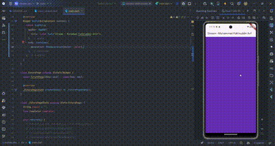

``` text
Nama   : Muhammad Fakhruddin Arif
NIM    : 2241720030
Kelas  : TI-3C
```
### Praktikum 1 - Dart Streams
#### Soal 1
##### Tambahkan nama panggilan anda pada title app sebagai identitas hasil pekerjaan anda.
``` dart
title: 'Stream - Muhammad Fakhruddin Arif',
```
##### Gantilah warna tema aplikasi sesuai dengan warna favorit anda.
``` dart
primarySwatch: Colors.blue,
```
#### Soal 2
##### Tambahkan 5 warna lainnya sesuai keinginan Anda pada variabel colors tersebut.
``` dart
class ColorStream {
  final List<Color> colors = [
    Colors.blueGrey,
    Colors.amber,
    Colors.deepPurple,
    Colors.lightBlue,
    Colors.teal,
    Colors.pinkAccent,
    Colors.green,
    Colors.red,
    Colors.orange,
    Colors.cyan
  ];
}
```
#### Soal 3
##### Jelaskan fungsi keyword yield* pada kode tersebut!
- `yield*` digunakan untuk mengembalikan nilai dari stream yang lain. Dalam kasus ini, `yield*` digunakan untuk mengembalikan nilai dari stream `colors` yang berisi list warna.
- `yield*` akan mengembalikan nilai satu per satu dari stream yang dijadikan sebagai parameter.
- `yield*` akan mengembalikan nilai dari stream yang dijadikan sebagai parameter sampai stream tersebut selesai.
- `yield*` akan mengembalikan nilai dari stream yang dijadikan sebagai parameter secara berurutan.
##### Apa maksud isi perintah kode tersebut?
- Maksud dari kode tersebut adalah untuk mengembalikan nilai dari stream `colors` yang berisi list warna.
- Setiap warna yang ada pada stream `colors` akan diambil satu per satu dan dikembalikan sebagai nilai stream.
- Setelah semua warna pada stream `colors` diambil, maka stream akan selesai.
#### Soal 4
Hasil dari praktikum 1 adalah sebagai berikut:

#### Soal 5
##### Jelaskan perbedaan menggunakan listen dan await for
- `listen` digunakan untuk mendengarkan perubahan pada stream. Ketika stream mengeluarkan nilai, maka nilai tersebut akan diambil dan diproses.
- `await for` digunakan untuk menunggu stream mengeluarkan nilai. Ketika stream mengeluarkan nilai, maka nilai tersebut akan diambil dan diproses.
- Perbedaan antara `listen` dan `await for` adalah pada cara pengambilan nilai dari stream. `listen` akan mengambil nilai dari stream ketika stream mengeluarkan nilai, sedangkan `await for` akan menunggu stream mengeluarkan nilai.
