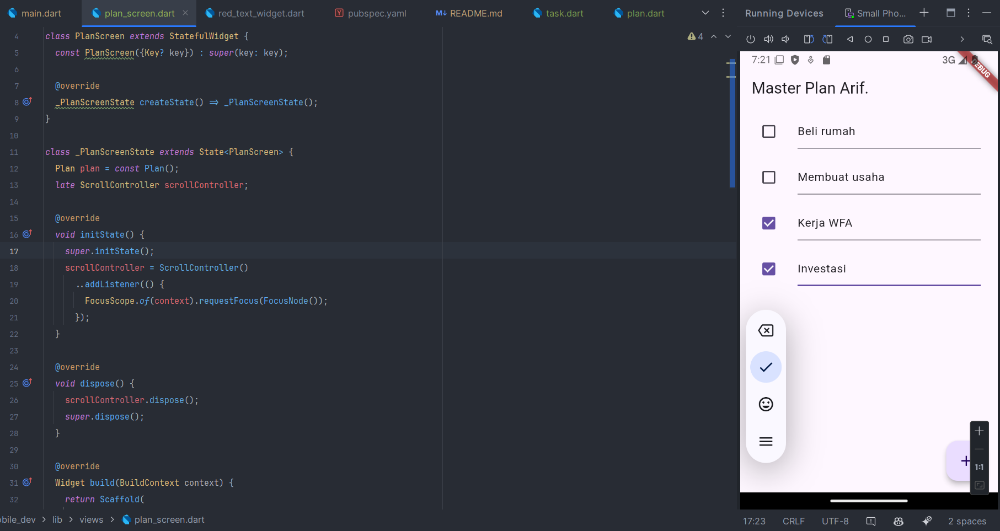
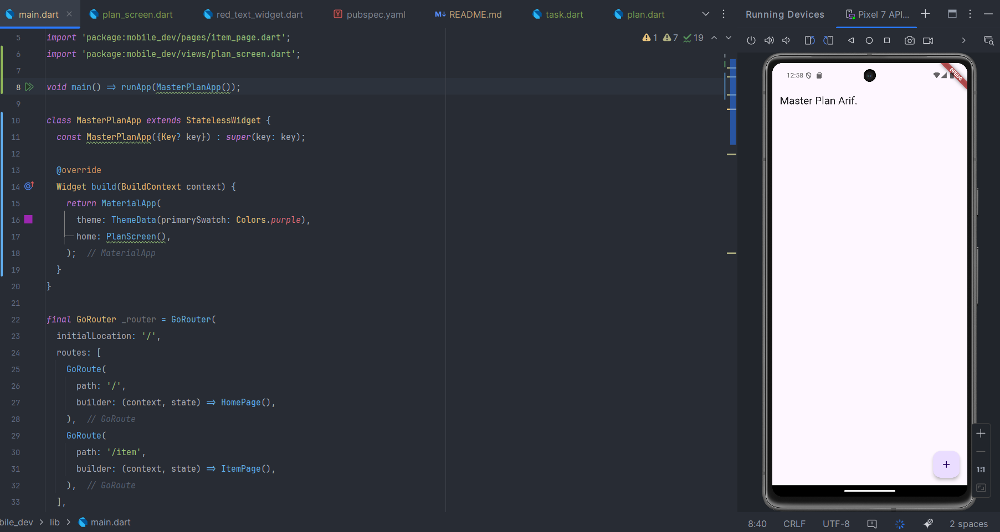
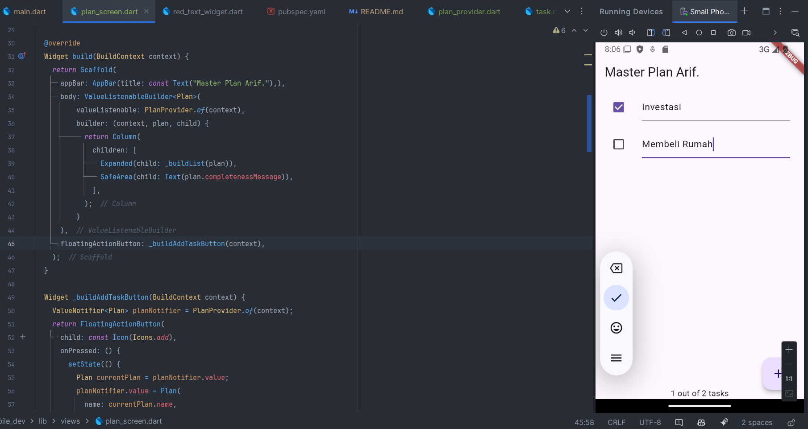
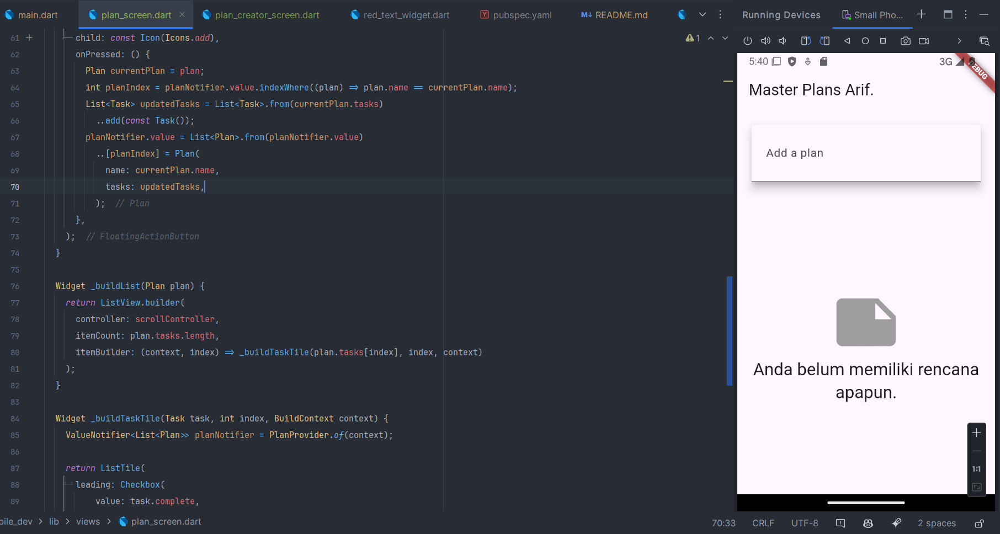
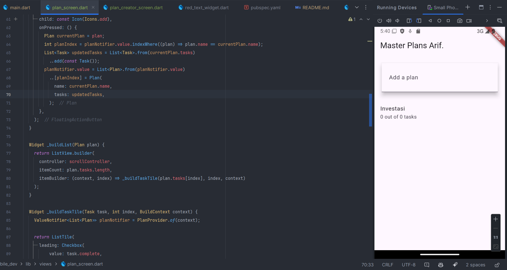
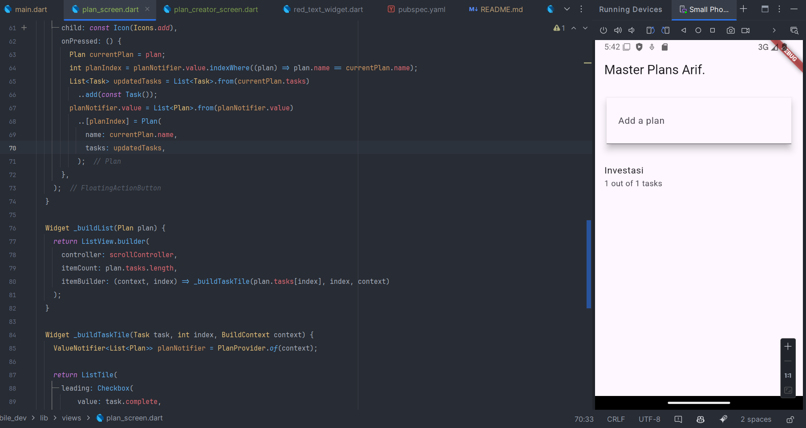

``` text
Nama   : Muhammad Fakhruddin Arif
NIM    : 2241720030
Kelas  : TI-3C
```
### Praktikum 1
#### 1. Membuat model task.dart
``` dart
class Task {
  final String description;
  final bool complete;

  const Task({this.description = '', this.complete = false});
}
```
Penjelasan:
- `Task` adalah class yang berisi atribut `description` dan `complete`.
- `description` adalah deskripsi dari task yang akan dibuat.
- `complete` adalah status task yang akan dibuat.
- `const Task({this.description = '', this.complete = false});` adalah konstruktor dari class `Task` yang memiliki parameter `description` dan `complete` yang memiliki
- nilai default `''` dan `false`.

#### 2. Membuat file plan.dart
``` dart
import 'package:mobile_dev/models/task.dart';

class Plan {
  final String name;
  final List<Task> tasks;

  const Plan({this.name = '', this.tasks = const []});
}
```
Penjelasan:
- `Plan` adalah class yang berisi atribut `name` dan `tasks`.
- `name` adalah nama dari plan yang akan dibuat.
- `tasks` adalah list dari task yang akan dibuat.
- `const Plan({this.name = '', this.tasks = const []});` adalah konstruktor dari class `Plan` yang memiliki parameter `name` dan `tasks` yang memiliki nilai default `''` dan `[]`.
- `import 'package:mobile_dev/models/task.dart';` adalah import dari file `task.dart`.
- `List<Task> tasks` adalah list dari task yang akan dibuat.
- `const []` adalah list yang kosong.
- `final String name` adalah nama dari plan yang akan dibuat.

#### 3. Membuat file plan_data.dart
``` dart
export 'plan.dart';
export 'task.dart';
```
Penjelasan:
- `export 'plan.dart';` adalah export dari file `plan.dart`.
- `export 'task.dart';` adalah export dari file `task.dart`.

#### 4. Pindah ke main.dart
``` dart
import 'package:flutter/material.dart';
import './views/plan_screen.dart';

void main() => runApp(MasterPlanApp());

class MasterPlanApp extends StatelessWidget {
  const MasterPlanApp({super.key});

  @override
  Widget build(BuildContext context) {
    return MaterialApp(
     theme: ThemeData(primarySwatch: Colors.purple),
     home: PlanScreen(),
    );
  }
}
```
Penjelasan:
- Terjadi error pada PlanScreen karena belum dibuat. Maka, kita harus membuat file plan_screen.dart terlebih dahulu.

#### 5. Membuat file plan_screen.dart
``` dart
import '../models/data_layer.dart';
import 'package:flutter/material.dart';

class PlanScreen extends StatefulWidget {
  const PlanScreen({super.key});

  @override
  State createState() => _PlanScreenState();
}

class _PlanScreenState extends State<PlanScreen> {
  Plan plan = const Plan();

  @override
  Widget build(BuildContext context) {
   return Scaffold(
    appBar: AppBar(title: const Text('Master Plan Arif')),
    body: _buildList(),
    floatingActionButton: _buildAddTaskButton(),
   );
  }
}
```
Penjelasan:
- Terjadi error pada _buildList() dan _buildAddTaskButton() karena belum dibuat. Maka, kita harus membuatnya terlebih dahulu.

#### 6. Membuat _buildAddTaskButton()
``` dart
Widget _buildAddTaskButton() {
  return FloatingActionButton(
   child: const Icon(Icons.add),
   onPressed: () {
     setState(() {
      plan = Plan(
       name: plan.name,
       tasks: List<Task>.from(plan.tasks)
       ..add(const Task()),
     );
    });
   },
  );
}
```
Penjelasan:
- `FloatingActionButton` adalah tombol yang berada di bawah kanan layar.
- `child: const Icon(Icons.add),` adalah icon yang berada di dalam tombol.
- `onPressed: () {` adalah fungsi yang akan dijalankan ketika tombol ditekan.
- `setState(() {` adalah fungsi yang akan mengubah state dari widget.
- `plan = Plan(` adalah mengubah nilai dari plan.
- `name: plan.name,` adalah mengambil nilai dari plan.name.
- `tasks: List<Task>.from(plan.tasks)` adalah mengambil nilai dari plan.tasks.
- `..add(const Task()),` adalah menambahkan task baru ke dalam list tasks.

#### 7. Membuat _buildList()
``` dart
Widget _buildList() {
  return ListView.builder(
   itemCount: plan.tasks.length,
   itemBuilder: (context, index) =>
   _buildTaskTile(plan.tasks[index], index),
  );
}
```
Penjelasan:
- `ListView.builder(` adalah widget yang akan menampilkan list item.
- `itemCount: plan.tasks.length,` adalah jumlah item yang akan ditampilkan.
- `itemBuilder: (context, index) =>` adalah builder yang akan membuat item.
- `_buildTaskTile(plan.tasks[index], index),` adalah membuat item task.
- `plan.tasks[index]` adalah task yang akan ditampilkan.
- `index` adalah index dari task.

#### 8. Membuat _buildTaskTile()
``` dart
Widget _buildTaskTile(Task task, int index) {
    return ListTile(
      leading: Checkbox(
          value: task.complete,
          onChanged: (selected) {
            setState(() {
              plan = Plan(
                name: plan.name,
                tasks: List<Task>.from(plan.tasks)
                  ..[index] = Task(
                    description: task.description,
                    complete: selected ?? false,
                  ),
              );
            });
          }),
      title: TextFormField(
        initialValue: task.description,
        onChanged: (text) {
          setState(() {
            plan = Plan(
              name: plan.name,
              tasks: List<Task>.from(plan.tasks)
                ..[index] = Task(
                  description: text,
                  complete: task.complete,
                ),
            );
          });
        },
      ),
    );
  }
```
Penjelasan:
- Pada _buildTaskTile() terdapat 2 widget yaitu `Checkbox` dan `TextFormField`.
- `Checkbox` adalah widget yang berisi checkbox.
- dan `TextFormField` adalah widget yang berisi text field.
- `value: task.complete,` adalah nilai dari checkbox.
- `onChanged: (selected) {` adalah fungsi yang akan dijalankan ketika checkbox diubah.
- `setState(() {` adalah fungsi yang akan mengubah state dari widget.
- `plan = Plan(` adalah mengubah nilai dari plan.
- `name: plan.name,` adalah mengambil nilai dari plan.name.
- `tasks: List<Task>.from(plan.tasks)` adalah mengambil nilai dari plan.tasks.
- `..[index] = Task(` adalah mengubah task yang ada di index ke-i.
- `description: task.description,` adalah mengambil nilai dari task.description.
- `complete: selected ?? false,` adalah mengambil nilai dari selected atau false jika selected bernilai null.

#### 9. Tambah Scroll Controller
``` dart
late ScrollController scrollController;
```
Penjelasan:
- `late ScrollController scrollController;` adalah membuat variabel scrollController yang bertipe ScrollController.

#### 10. Tambah scroll listener
``` dart
@override
  void initState() {
    super.initState();
    scrollController = ScrollController()
      ..addListener(() {
        FocusScope.of(context).requestFocus(FocusNode());
      });
  }
```
Penjelasan:
- `scrollController = ScrollController()` adalah membuat scrollController.
- `..addListener(() {` adalah menambahkan listener ke scrollController.
- `FocusScope.of(context).requestFocus(FocusNode());` adalah menghilangkan focus dari text field.
- `@override` adalah mendeklarasikan bahwa kita akan meng-override method initState() dari parent class.
- `void initState() {` adalah method yang akan dijalankan ketika widget diinisialisasi.
- `super.initState();` adalah memanggil method initState() dari parent class.

#### 11. Tambah controller dan keyboard behavior
``` dart
Widget _buildList() {
    return ListView.builder(
      controller: scrollController,
      keyboardDismissBehavior: Theme.of(context).platform == TargetPlatform.iOS
          ? ScrollViewKeyboardDismissBehavior.onDrag
          : ScrollViewKeyboardDismissBehavior.manual,
      itemCount: plan.tasks.length,
      itemBuilder: (context, index) =>
          _buildTaskTile(plan.tasks[index], index),
    );
  }
```
Penjelasan:
- `controller: scrollController,` adalah memberikan controller ke ListView.
- `keyboardDismissBehavior: Theme.of(context).platform == TargetPlatform.iOS` adalah memberikan behavior keyboard dismiss.
- `ScrollViewKeyboardDismissBehavior.onDrag` adalah behavior keyboard dismiss pada iOS.
- `ScrollViewKeyboardDismissBehavior.manual` adalah behavior keyboard dismiss manual.

#### 12. Tambah method dispose
``` dart
@override
  void dispose() {
    scrollController.dispose();
    super.dispose();
  }
```
Penjelasan:
- `scrollController.dispose();` adalah menghapus scrollController.
- `super.dispose();` adalah memanggil method dispose() dari parent class.
- `@override` adalah mendeklarasikan bahwa kita akan meng-override method dispose() dari parent class.
- `void dispose() {` adalah method yang akan dijalankan ketika widget dihapus.

#### 13. Hasil


### Tugas Praktikum 1
#### Jelaskan maksud dari langkah 4 pada praktikum tersebut! Mengapa dilakukan demikian?
``` txt
Maksud dari perintah export 'plan.dart'; dan export 'task.dart'; adalah untuk menggabungkan beberapa file menjadi satu modul yang dapat diimpor dengan satu pernyataan import. 
Ini memudahkan pengelolaan dan penggunaan kode dengan mengurangi jumlah pernyataan import yang diperlukan di file lain.

Mengapa dilakukan demikian?
- Modularisasi: Memisahkan kode ke dalam beberapa file membuatnya lebih terorganisir dan mudah dikelola.
- Kemudahan Penggunaan: Dengan menggabungkan beberapa file menjadi satu modul, Anda dapat mengimpor semua yang Anda butuhkan dengan satu pernyataan import.
- Pengurangan Redundansi: Mengurangi jumlah pernyataan import yang diperlukan di file lain, sehingga kode menjadi lebih bersih dan lebih mudah dibaca.
```
#### Mengapa perlu variabel plan di langkah 6 pada praktikum tersebut? Mengapa dibuat konstanta ?
``` txt
Variabel plan diperlukan untuk menyimpan data plan yang akan ditampilkan di layar. Variabel plan dibuat konstan agar nilai dari plan tidak dapat diubah setelah diinisialisasi.
```
#### Lakukan capture hasil dari Langkah 9 berupa GIF, kemudian jelaskan apa yang telah Anda buat!



``` text
Pada langkah 1 hingga langkah 8, saya membuat aplikasi Master Plan Arif yang berisi list task yang dapat ditambahkan dan diubah statusnya.
```
#### Apa kegunaan method pada Langkah 11 dan 13 dalam lifecyle state ?
``` txt
Pada langkah 11, method initState() digunakan untuk melakukan inisialisasi state dari widget. 
Sedangkan pada langkah 13, method dispose() digunakan untuk membersihkan state dari widget ketika widget dihapus.
```

### Praktikum 2
#### 1. Membuat file plan_provider.dart
``` dart
class PlanProvider extends InheritedNotifier<ValueNotifier<Plan>> {
  const PlanProvider({super.key, required Widget child, required
  ValueNotifier<Plan> notifier})
      : super(child: child, notifier: notifier);

  static ValueNotifier<Plan> of(BuildContext context) {
    return context.
    dependOnInheritedWidgetOfExactType<PlanProvider>()!.notifier!;
  }
}
```
Penjelasan:
- `PlanProvider` adalah class yang meng-extends `InheritedNotifier<ValueNotifier<Plan>>`.
- `InheritedNotifier<ValueNotifier<Plan>>` adalah class yang meng-extends `InheritedWidget` dan `ValueNotifier`.
- `ValueNotifier<Plan>` adalah class yang berisi data plan.
- `PlanProvider({super.key, required Widget child, required ValueNotifier<Plan> notifier})` adalah konstruktor dari class `PlanProvider` yang memiliki parameter `child` dan `notifier`.
- `static ValueNotifier<Plan> of(BuildContext context)` adalah method yang akan mengembalikan notifier dari `PlanProvider`.
- `return context.dependOnInheritedWidgetOfExactType<PlanProvider>()!.notifier!;` adalah mengembalikan notifier dari `PlanProvider`.

#### 2. Edit file main.dart
``` dart
class MasterPlanApp extends StatelessWidget {
  const MasterPlanApp({Key? key}) : super(key: key);

  @override
  Widget build(BuildContext context) {
    return MaterialApp(
      theme: ThemeData(primarySwatch: Colors.purple),
      home: PlanProvider(
          child: const PlanScreen(),
          notifier: ValueNotifier<Plan>(const Plan())
      ),
    );
  }
}
```
Penjelasan:
- `PlanProvider` adalah class yang berisi data plan.
- `child: const PlanScreen(),` adalah child dari `PlanProvider`.
- `notifier: ValueNotifier<Plan>(const Plan())` adalah notifier dari `PlanProvider`.

#### 3. Tambah method pada model plan.dart
``` dart
int get completedCount => tasks.where((task) => task.complete).length;
String get completenessMessage => '$completedCount out of ${tasks.length} tasks';
```
Penjelasan:
- `int get completedCount => tasks.where((task) => task.complete).length;` adalah menghitung jumlah task yang sudah selesai.
- `String get completenessMessage => '$completedCount out of ${tasks.length} tasks';` adalah mengembalikan pesan yang berisi jumlah task yang sudah selesai.

#### 4. Pindah ke plan_screen.dart
- Menghapus variabel plan

#### 5. Edit _buildAddTaskButton
``` dart
Widget _buildAddTaskButton(BuildContext context) {
    ValueNotifier<Plan> planNotifier = PlanProvider.of(context);
    return FloatingActionButton(
      child: const Icon(Icons.add),
      onPressed: () {
        setState(() {
          Plan currentPlan = planNotifier.value;
          planNotifier.value = Plan(
            name: currentPlan.name,
            tasks: List<Task>.from(currentPlan.tasks)
              ..add(const Task()),
          );
        });
      },
    );
  }
```
Penjelasan:
- `ValueNotifier<Plan> planNotifier = PlanProvider.of(context);` adalah mendapatkan notifier dari `PlanProvider`.
- `Plan currentPlan = planNotifier.value;` adalah mendapatkan nilai dari notifier.
- `planNotifier.value = Plan(` adalah mengubah nilai dari notifier.
- `name: currentPlan.name,` adalah mengambil nilai dari currentPlan.name.
- `tasks: List<Task>.from(currentPlan.tasks)` adalah mengambil nilai dari currentPlan.tasks.
- `..add(const Task()),` adalah menambahkan task baru ke dalam list tasks.

#### 6. Edit _buildTaskTile
``` dart
Widget _buildTaskTile(Task task, int index, BuildContext context) {
    ValueNotifier<Plan> planNotifier = PlanProvider.of(context);

    return ListTile(
      leading: Checkbox(
          value: task.complete,
          onChanged: (selected) {
            Plan currentPlan = planNotifier.value;
            planNotifier.value = Plan(
              name: currentPlan.name,
              tasks: List<Task>.from(currentPlan.tasks)
                ..[index] = Task(
                  description: task.description,
                  complete: selected ?? false,
                ),
            );
          }),
      title: TextFormField(
        initialValue: task.description,
        onChanged: (text) {
          Plan currentPlan = planNotifier.value;
          planNotifier.value = Plan(
            name: currentPlan.name,
            tasks: List<Task>.from(currentPlan.tasks)
              ..[index] = Task(
                description: text,
                complete: task.complete,
              ),
          );
        },
      ),
    );
  }
```
Penjelasan:
- Widget `_buildTaskTile` menerima parameter `BuildContext context`.
- `ValueNotifier<Plan> planNotifier = PlanProvider.of(context);` adalah mendapatkan notifier dari `PlanProvider`.
- `Plan currentPlan = planNotifier.value;` adalah mendapatkan nilai dari notifier.
- `planNotifier.value = Plan(` adalah mengubah nilai dari notifier.
- `name: currentPlan.name,` adalah mengambil nilai dari currentPlan.name.
- `tasks: List<Task>.from(currentPlan.tasks)` adalah mengambil nilai dari currentPlan.tasks.
- `..[index] = Task(` adalah mengubah task yang ada di index ke-i.

#### 7. Edit _buildList
``` dart
Widget _buildList(Plan plan) {
    return ListView.builder(
      controller: scrollController,
      itemCount: plan.tasks.length,
      itemBuilder: (context, index) => _buildTaskTile(plan.tasks[index], index, context)
    );
  }
```
Penjelasan:
- Widget `_buildList` menerima parameter `Plan plan`.
- `itemBuilder: (context, index) => _buildTaskTile(plan.tasks[index], index, context)` adalah membuat item task.
- `plan.tasks[index]` adalah task yang akan ditampilkan.

#### 8. Tambah widget SafeArea
``` dart
Widget build(BuildContext context) {
    return Scaffold(
      appBar: AppBar(title: const Text("Master Plan Arif."),),
      body: ValueListenableBuilder<Plan>(
          valueListenable: PlanProvider.of(context),
          builder: (context, plan, child) {
            return Column(
              children: [
                Expanded(child: _buildList(plan)),
                SafeArea(child: Text(plan.completenessMessage)),
              ],
            );
          }
      ),
      floatingActionButton: _buildAddTaskButton(context),
    );
  }
```
Penjelasan:
- `SafeArea(child: Text(plan.completenessMessage))` adalah menampilkan pesan keberhasilan.
- `Text(plan.completenessMessage)` adalah pesan keberhasilan.
- `Expanded(child: _buildList(plan))` adalah membuat list task.
- `valueListenable: PlanProvider.of(context),` adalah mendapatkan notifier dari `PlanProvider`.
- `builder: (context, plan, child) {` adalah builder yang akan membuat item.

### Tugas Praktikum 2
#### Jelaskan mana yang dimaksud InheritedWidget pada langkah 1 tersebut! Mengapa yang digunakan InheritedNotifier?
``` text
InheritedWidget adalah widget yang dapat digunakan untuk membagikan data ke dalam subtree widget.
InheritedNotifier adalah class yang meng-extends InheritedWidget dan ValueNotifier. InheritedNotifier digunakan karena dapat menggabungkan InheritedWidget dan ValueNotifier.
```
#### Jelaskan maksud dari method di langkah 3 pada praktikum tersebut! Mengapa dilakukan demikian?
``` text
Maksud dari method di langkah 3 adalah untuk menghitung jumlah task yang sudah selesai dan mengembalikan pesan yang berisi jumlah task yang sudah selesai.
```
#### Lakukan capture hasil dari Langkah 9 berupa GIF, kemudian jelaskan apa yang telah Anda buat!


### Praktikum 3
#### 1. Edit PlanProvider
``` dart
class PlanProvider extends InheritedNotifier<ValueNotifier<List<Plan>>> {
  const PlanProvider({super.key, required Widget child, required ValueNotifier<Plan> notifier}) : super(child: child, notifier: notifier);

  static ValueNotifier<List<Plan>> of(BuildContext context) {
    return context.dependOnInheritedWidgetOfExactType<PlanProvider>()!.notifier!;
  }
}
```
Penjelasan:
- `ValueNotifier<List<Plan>>` adalah class yang berisi list dari plan.
- `ValueNotifier<Plan> notifier` diganti menjadi `ValueNotifier<List<Plan>> notifier`.
- `List<Plan>` adalah list dari plan.
- `ValueNotifier<List<Plan>>` adalah class yang berisi data plan.

#### 2. Edit main.dart
``` dart
Widget build(BuildContext context) {
  return PlanProvider(
    notifier: ValueNotifier<List<Plan>>(const []),
    child: MaterialApp(
      title: 'State management app',
      theme: ThemeData(
        primarySwatch: Colors.blue,
      ),
      home: const PlanScreen(),
    ),
  );
}
```
Penjelasan:
- `ValueNotifier<List<Plan>>` adalah class yang berisi list dari plan.
- PlanProvider adalah class yang berisi data plan.

#### 3. Edit plan_screen.dart
``` dart
final Plan plan;
const PlanScreen({super.key, required this.plan});
```
Penjelasan:
- `final Plan plan;` adalah membuat variabel plan.
- `required this.plan` adalah parameter yang harus diisi.

#### 4. Tambah getter plan
``` dart
Plan get plan => widget.plan;
```
Penjelasan:
- `Plan get plan => widget.plan;` adalah getter dari plan.

#### 5. Method initState
- Pada method initState, tidak perlu ada perubahan.

#### 6. Widget build
Penjelasan:
- Mengganti tipe data dari `ValueNotifier<Plan>` menjadi `ValueNotifier<List<Plan>`.
- Pada bagian appBar, mengganti title menjadi plan.name.
- Mengganti semua tipe data dari `Plan` menjadi `List<Plan>`.

#### 7. Edit _buildTaskTile
``` dart
ValueNotifier<List<Plan>> planNotifier = PlanProvider.of(context);
```
Penjelasan:
- Hanya mengganti variabel planNotifier menjadi List.

#### 8. Buat screen baru
``` dart
home: const PlanCreatorScreen(),
```
Penjelasan:
- `const PlanCreatorScreen()` adalah membuat screen baru dalam bentuk stateful.

#### 9. Pindah ke class _PlanCreatorScreenState
``` dart
  final textController = TextEditingController();

  @override
  void dispose() {
    textController.dispose();
    super.dispose();
  }
```
Penjelasan:
- `final textController = TextEditingController();` adalah membuat variabel textController.
- `textController.dispose();` adalah menghapus textController.
- `super.dispose();` adalah memanggil method dispose() dari parent class.

#### 10. Pindah ke method build
``` dart
Widget build(BuildContext context) {
    return Scaffold(
      appBar: AppBar(title: const Text('Master Plans Arif.')),
      body: Column(
        children: [
          _buildListCreator(),
          Expanded(child: _buildMasterPlans()),
        ],
      ),
    );
  }
```
Penjelasan:
- `appBar: AppBar(title: const Text('Master Plans Arif.'))` adalah membuat app bar.
- `Expanded(child: _buildMasterPlans())` adalah membuat list master plans.
- `_buildListCreator()` adalah membuat list creator.

#### 11. Buat widget _buildListCreator
``` dart
Widget _buildListCreator() {
    return Padding(
      padding: const EdgeInsets.all(20.0),
      child: Material(
        color: Theme.of(context).cardColor,
        elevation: 10,
        child: TextField(
          controller: textController,
          decoration: const InputDecoration(
            labelText: 'Add a plan',
            contentPadding: EdgeInsets.all(20),
          ),
          onEditingComplete: addPlan,
        ),
      ),
    );
  }
```
Penjelasan:
- `Padding(padding: const EdgeInsets.all(20.0)` adalah memberikan padding.
- `Material(color: Theme.of(context).cardColor,` adalah memberikan warna background.
- `TextField(controller: textController,` adalah membuat text field.
- `decoration: const InputDecoration(` adalah memberikan dekorasi pada text field.
- `onEditingComplete: addPlan,` adalah menambahkan plan.

#### 12. Buat method addPlan
``` dart
void addPlan() {
    final text = textController.text;
    if (text.isEmpty) return;
    final plan = Plan(name: text, tasks: []);
    ValueNotifier<List<Plan>> planNotifier = PlanProvider.of(context);
    planNotifier.value = List<Plan>.from(planNotifier.value)..add(plan);
    textController.clear();
    FocusScope.of(context).requestFocus(FocusNode());
    setState(() {});
  }
```
Penjelasan:
- `final text = textController.text;` adalah mengambil nilai dari text field.
- `if (text.isEmpty) return;` adalah jika text field kosong, maka akan kembali.
- `final plan = Plan(name: text, tasks: []);` adalah membuat plan baru.
- `ValueNotifier<List<Plan>> planNotifier = PlanProvider.of(context);` adalah mendapatkan notifier dari `PlanProvider`.
- `planNotifier.value = List<Plan>.from(planNotifier.value)..
- add(plan);` adalah menambahkan plan baru ke dalam list plan.
- `textController.clear();` adalah menghapus text field.
- `FocusScope.of(context).requestFocus(FocusNode());` adalah menghilangkan focus dari text field.
- `setState(() {});` adalah mengubah state dari widget.

#### 13. Buat widget _buildMasterPlans
``` dart
Widget _buildMasterPlans() {
    ValueNotifier<List<Plan>> planNotifier = PlanProvider.of(context);
    List<Plan> plans = planNotifier.value;

    if (plans.isEmpty) {
      return Column(
        mainAxisAlignment: MainAxisAlignment.center,
        children: [
          const Icon(Icons.note, size: 100, color: Colors.grey),
          Text(
              'Anda belum memiliki rencana apapun.',
              style: Theme.of(context).textTheme.headlineSmall
          ),
        ],
      );
    }

    return ListView.builder(
      itemCount: plans.length,
      itemBuilder: (context, index) {
        final plan = plans[index];
        return ListTile(
          title: Text(plan.name),
          subtitle: Text(plan.completenessMessage),
          onTap: () {
            Navigator.of(context).push(
              MaterialPageRoute(
                builder: (_) => PlanScreen(plan: plan),
              ),
            );
          },
        );
      },
    );
  }
```
Penjelasan:
- `ValueNotifier<List<Plan>> planNotifier = PlanProvider.of(context);` adalah mendapatkan notifier dari `PlanProvider`.
- `List<Plan> plans = planNotifier.value;` adalah mendapatkan nilai dari notifier.
- `if (plans.isEmpty) {` adalah jika list plan kosong, maka akan menampilkan pesan.
- `return Column(` adalah membuat column.
- `return ListView.builder(` adalah membuat list view.
- `itemCount: plans.length,` adalah jumlah item yang akan ditampilkan.
- `final plan = plans[index];` adalah mendapatkan plan dari index ke-i.
- `return ListTile(` adalah membuat list tile.
- `title: Text
- (plan.name),` adalah menampilkan nama plan.
- `subtitle: Text(plan.completenessMessage),` adalah menampilkan pesan keberhasilan.
- `onTap: () {` adalah fungsi yang akan dijalankan ketika list tile ditekan.
- `Navigator.of(context).push(` adalah berpindah ke screen baru.
- `builder: (_) => PlanScreen(plan: plan),` adalah membuat screen baru.
- `Icon(Icons.note, size: 100, color: Colors.grey),` adalah icon note.
- `Text('Anda belum memiliki rencana apapun.',` adalah pesan jika list plan kosong.
- `style: Theme.of(context).textTheme.headlineSmall` adalah style dari text.

#### 14. Hasil
- Tampilan awal



- Tambah Plan



- Tampilan Plan



### Tugas Praktikum 3
#### Berdasarkan Praktikum 3 yang telah Anda lakukan, jelaskan maksudnya!
``` text
Gambar tersebut menggambarkan alur navigasi dan struktur widget pada aplikasi master plan yang terdiri dari dua bagian: sebelum dan sesudah navigasi menggunakan Navigator Push.
Penjelasan bagian kiri:
1. MaterialApp - Merupakan widget utama yang membungkus aplikasi dan memberikan tema, routing, dan pengaturan lainnya.
2. PlanProvider - Sepertinya ini adalah sebuah provider yang digunakan untuk manajemen state dalam aplikasi, kemungkinan menggunakan paket seperti Provider untuk mengelola state global.
3. PlanCreatorScreen - Ini adalah screen atau halaman yang bertanggung jawab untuk membuat rencana (plan). Screen ini terdiri dari beberapa widget utama:
    - Column - Layout vertikal yang menampung beberapa widget.
    - TextField - Komponen input untuk teks.
    - Expanded - Widget yang memperluas child-nya untuk mengisi ruang yang tersisa di dalam layout.
    - ListView - Widget untuk menampilkan list atau daftar secara scrollable.

Penjelasan bagian kanan(Setelah navigasi):
1. MaterialApp - Masih menjadi wrapper utama aplikasi.
2. PlanScreen - Setelah pengguna melakukan navigasi dengan Navigator Push, mereka diarahkan ke PlanScreen, yang mungkin berisi rencana yang sudah dibuat atau melihat detail rencana.
3. Scaffold - Merupakan widget dasar untuk menyusun struktur aplikasi di Flutter, memberikan layout seperti AppBar, Drawer, dan Body.
4. Column - Tata letak vertikal yang menampung beberapa elemen.
    - Expanded - Sama seperti sebelumnya, memperluas widget child agar mengisi ruang kosong.
    - SafeArea - Widget ini memastikan konten tidak tumpang tindih dengan area yang mungkin terhalang seperti notch atau status bar.
    - ListView - Masih digunakan untuk menampilkan daftar data secara scrollable.
    - Text - Menampilkan teks pada screen.
```
#### Jelaskan apa yang dilakukan pada praktikum 3!
``` text
Pada praktikum 3, saya membuat aplikasi Master Plan Arif yang berisi list plan yang dapat ditambahkan dan diubah statusnya.
Dan saya menambahkan fitur untuk menambahkan plan baru.
```