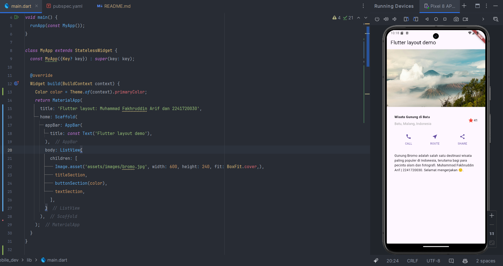

``` text
Nama   : Muhammad Fakhruddin Arif
NIM    : 2241720030
Kelas  : TI-3C
```
### Praktikum 1: Membangun Layout di Flutter
#### 1. File main.dart, Isilah dengan nama dan NIM anda pada text title
```dart
  Widget build(BuildContext context) {
    return MaterialApp(
      title: 'Flutter layout: Muhammad Fakhruddin Arif dan 2241720030',
      home: Scaffold(
        appBar: AppBar(
          title: const Text('Flutter layout demo'),
        ),
        body: const Center(
          child: Text('Hello World'),
        ),
      ),
    );
  }
```
Berikut adalah hasil dari kode diatas:


#### 2. Implementasi title row
``` dart
Widget titleSection = Container(
  padding: const EdgeInsets.all(32),
  child: Row(
    children: [
      Expanded(
        /* soal 1*/
        child: Column(
          crossAxisAlignment: CrossAxisAlignment.start,
          children: [
            /* soal 2*/
            Container(
              padding: const EdgeInsets.only(bottom: 8),
              child: const Text(
                'Wisata Gunung di Batu',
                style: TextStyle(
                  fontWeight: FontWeight.bold,
                ),
              ),
            ),
            Text(
              'Batu, Malang, Indonesia',
              style: TextStyle(
                color: Colors.grey,
              ),
            ),
          ],
        ),
      ),
      /* soal 3*/
      Icon(
        Icons.star,
        color: Colors.red,
      ),
      const Text("41"),
    ],
  ),
);
```
Berikut adalah hasil dari kode diatas:


### Praktikum 2: Implementasi button Row
#### 1. Buat Method Column _buildButtonColumn
``` dart
  Column _buildButtonColumn(Color color, IconData icon, String label) {
    return Column(
      mainAxisSize: MainAxisSize.min,
      mainAxisAlignment: MainAxisAlignment.center,
      children: [
        Icon(icon, color: color),
        Container(
          margin: const EdgeInsets.only(top: 8),
          child: Text(
            label,
            style: TextStyle(
              fontSize: 12,
              fontWeight: FontWeight.w400,
              color: color,
            ),
          ),
        ),
      ],
    );
  }
```
#### 2. Buat widget buttonSection
``` dart
Widget buttonSection (Color color) => Row(
  mainAxisAlignment: MainAxisAlignment.spaceEvenly,
  children: [
    _buildButtonColumn(color, Icons.call, 'CALL'),
    _buildButtonColumn(color, Icons.near_me, 'ROUTE'),
    _buildButtonColumn(color, Icons.share, 'SHARE'),
  ],
);
```
#### 3. Tambah Section buttonSection pada body
``` dart
class MyApp extends StatelessWidget {
  const MyApp({Key? key}) : super(key: key);

  @override
  Widget build(BuildContext context) {
    Color color = Theme.of(context).primaryColor;
    return MaterialApp(
      title: 'Flutter layout: Muhammad Fakhruddin Arif dan 2241720030',
      home: Scaffold(
        appBar: AppBar(
          title: const Text('Flutter layout demo'),
        ),
        body: Column(
          children: [
            titleSection,
            buttonSection(color),
          ],
        )
      ),
    );
  }
}
```
Berikut adalah hasil dari kode diatas:


### Praktikum 3: Implementasi text section
#### 1. Buat widget textSection
``` dart
Widget textSection = Container(
  padding: const EdgeInsets.all(32),
  child: const Text(
    "Gunung Bromo adalah salah satu destinasi wisata paling populer di Indonesia, terutama bagi para pecinta alam dan fotografi."
    " Muhammad Fakhruddin Arif | 2241720030."
        " Selamat mengerjakan 🙂.",
    softWrap: true,
  ),
);
```
#### 2. Tambah Section textSection pada body
``` dart
class MyApp extends StatelessWidget {
  const MyApp({Key? key}) : super(key: key);

  @override
  Widget build(BuildContext context) {
    Color color = Theme.of(context).primaryColor;
    return MaterialApp(
      title: 'Flutter layout: Muhammad Fakhruddin Arif dan 2241720030',
      home: Scaffold(
        appBar: AppBar(
          title: const Text('Flutter layout demo'),
        ),
        body: Column(
          children: [
            titleSection,
            buttonSection(color),
            textSection,
          ],
        )
      ),
    );
  }
}
```
Berikut adalah hasil dari kode diatas:


### Praktikum 4: Implementasi image section
#### 1. Siapkan asset gambar

#### 2. Tambahkan gambar ke body
``` dart
class MyApp extends StatelessWidget {
  const MyApp({Key? key}) : super(key: key);

  @override
  Widget build(BuildContext context) {
    Color color = Theme.of(context).primaryColor;
    return MaterialApp(
      title: 'Flutter layout: Muhammad Fakhruddin Arif dan 2241720030',
      home: Scaffold(
        appBar: AppBar(
          title: const Text('Flutter layout demo'),
        ),
        body: Column(
          children: [
            Image.asset('assets/images/bromo.jpg', width: 600, height: 240, fit: BoxFit.cover,),
            titleSection,
            buttonSection(color),
            textSection,
          ],
        )
      ),
    );
  }
}
```
Berikut adalah hasil dari kode diatas:


#### 3. Ubah menjadi ListView
``` dart
class MyApp extends StatelessWidget {
  const MyApp({Key? key}) : super(key: key);

  @override
  Widget build(BuildContext context) {
    Color color = Theme.of(context).primaryColor;
    return MaterialApp(
      title: 'Flutter layout: Muhammad Fakhruddin Arif dan 2241720030',
      home: Scaffold(
        appBar: AppBar(
          title: const Text('Flutter layout demo'),
        ),
        body: ListView(
          children: [
            Image.asset('assets/images/bromo.jpg', width: 600, height: 240, fit: BoxFit.cover,),
            titleSection,
            buttonSection(color),
            textSection,
          ],
        )
      ),
    );
  }
}
```
Berikut adalah hasil dari kode diatas:

