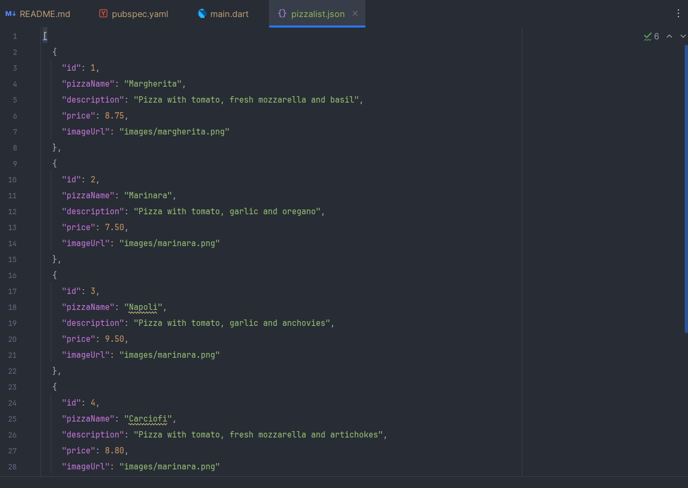

``` text
Nama   : Muhammad Fakhruddin Arif
NIM    : 2241720030
Kelas  : TI-3C
```
### Praktikum 1: Converting Dart models into JSON
#### 1. Di dalam folder aset, buat file baru bernama pizzalist.json dan salin konten yang tersedia di tautan https://gist.github.com/simoales/a33c1c2abe78b48a75ccfd5fa0de0620. File ini berisi daftar objek JSON.

#### 2. Di file pubspec.yaml, tambahkan referensi ke folder aset baru, seperti yang ditunjukkan di sini:

#### 3. Pada kelas _MyHomePageState, di main.dart, tambahkan sebuah variabel state bernama pizzaString:
``` dart
class _MyHomePageState extends State<MyHomePage> {
  String pizzaString = '';
  @override
  Widget build(BuildContext context) {
    return Scaffold(
      appBar: AppBar(
        title: const Text('JSON - Muhammad Fakhruddin Arif'),
      ),
      body: Container(),
    );
  }
}
```
#### 4. Untuk membaca isi file pizzalist.json, di bagian bawah kelas _MyHomePageState di main.dart, tambahkan metode asinkron baru yang disebut readJsonFile, yang akan mengatur nilai pizzaString, seperti yang ditunjukkan di sini:
``` dart
class _MyHomePageState extends State<MyHomePage> {
  String pizzaString = '';
  @override
  Widget build(BuildContext context) {
    return Scaffold(
      appBar: AppBar(
        title: const Text('JSON - Muhammad Fakhruddin Arif'),
      ),
      body: Container(),
    );
  }
  Future readJsonFile() async {
    String myString = await DefaultAssetBundle.of(context).loadString('assets/pizzalist.json');
    setState(() {
      pizzaString = myString;
    });
  }
}
```
#### 5. Pada kelas _MyHomePageState, timpa metode initState dan, di dalamnya, panggil metode readJsonFile:
``` dart
class _MyHomePageState extends State<MyHomePage> {
  String pizzaString = '';
  
  @override
  void initState() {
    super.initState();
    readJsonFile();
  }
  
  @override
  Widget build(BuildContext context) {
    return Scaffold(
      appBar: AppBar(
        title: const Text('JSON - Muhammad Fakhruddin Arif'),
      ),
      body: Container(),
    );
  }
  Future readJsonFile() async {
    String myString = await DefaultAssetBundle.of(context).loadString('assets/pizzalist.json');
    setState(() {
      pizzaString = myString;
    });
  }
}
```
#### 6. Sekarang, kita ingin menampilkan JSON yang diambil di properti dalam Scaffold. Untuk melakukannya, tambahkan widget Teks sebagai child dari Container kita:
``` dart
class _MyHomePageState extends State<MyHomePage> {
  String pizzaString = '';

  @override
  void initState() {
    super.initState();
    readJsonFile();
  }

  @override
  Widget build(BuildContext context) {
    return Scaffold(
      appBar: AppBar(
        title: const Text('JSON - Muhammad Fakhruddin Arif'),
      ),
      body: Text(pizzaString),
    );
  }

  Future readJsonFile() async {
    String myString = await DefaultAssetBundle.of(context).loadString('assets/pizzalist.json');
    setState(() {
      pizzaString = myString;
    });
  }
}
```
#### 7. Mari kita jalankan aplikasinya. Jika semuanya berjalan seperti yang diharapkan, Anda akan melihat konten file JSON di layar

#### 8. Kita ingin mengubah String ini menjadi sebuah List of Objects. Kita akan mulai dengan membuat kelas baru. Dalam folder lib aplikasi kita, buat file baru bernama pizza.dart.
``` dart
class Pizza {

}
```
#### 9. Di dalam file tersebut, tentukan properti kelas Pizza:
``` dart
class Pizza {
  final int id;
  final String pizzaName;
  final String description;
  final double price;
  final String imageUrl;
}
```
#### 10. Di dalam kelas Pizza, tentukan konstruktor bernama fromJson, yang akan mengambil sebuah Map sebagai parameter dan mengubah Map menjadi sebuah instance dari Pizza:
``` dart
class Pizza {
  final int id;
  final String pizzaName;
  final String description;
  final double price;
  final String imageUrl;

  Pizza.fromJson(Map<String, dynamic> json)
      : id = json['id'],
        pizzaName = json['pizzaName'],
        description = json['description'],
        price = json['price'],
        imageUrl = json['imageUrl'];
}
```
#### 11. Refaktor metode readJsonFile() pada kelas _MyHomePageState. Langkah pertama adalah mengubah String menjadi Map dengan memanggil metode jsonDecode. Pada method readJsonFile, tambahkan kode yang di cetak tebal berikut ini:
``` dart
Future readJsonFile() async {
   String myString = await DefaultAssetBundle.of(context).loadString('assets/pizzalist.json');
   List pizza = jsonDecode(myString);
   setState(() {
     pizzaString = pizza.toString();
   });
}
```
#### 12. Pastikan editor Anda secara otomatis menambahkan pernyataan impor untuk pustaka "dart:convert" di bagian atas file main.dart; jika tidak, tambahkan saja secara manual. Tambahkan juga pernyataan impor untuk kelas pizza:
``` dart
import 'dart:convert';
import 'package:mobile_dev/models/pizza.dart';
```
#### 13. Langkah terakhir adalah mengonversi string JSON kita menjadi List of native Dart objects. Kita dapat melakukan ini dengan mengulang pizzaMapList dan mengubahnya menjadi objek Pizza. Di dalam metode readJsonFile, di bawah metode jsonDecode, tambahkan kode berikut:
``` dart
Future readJsonFile() async {
  String myString = await DefaultAssetBundle.of(context).loadString('assets/pizzalist.json');
  List pizzaMap = jsonDecode(myString);
  List<Pizza> pizzas = [];
  for (var pizza in pizzaMap) {
    Pizza p = Pizza.fromJson(pizza);
    pizzas.add(p);
  }
}
```
#### 14. Tambahkan kode berikut ini di dalam Scaffold, di dalam metode build()
``` dart
class _MyHomePageState extends State<MyHomePage> {
  List<Pizza> pizzas = [];

  @override
  void initState() {
    super.initState();
    readJsonFile().then((value) {
      setState(() {
        pizzas = value;
      });
    });
  }

  @override
  Widget build(BuildContext context) {
    return Scaffold(
      appBar: AppBar(
        title: const Text('JSON - Muhammad Fakhruddin Arif'),
      ),
      body: ListView.builder(
        itemCount: pizzas.length,
        itemBuilder: (context, index) {
          return ListTile(
            title: Text(pizzas[index].pizzaName),
            subtitle: Text(pizzas[index].description),
          );
        },
      ),
    );
  }

  Future<List<Pizza>> readJsonFile() async {
    String myString = await DefaultAssetBundle.of(context).loadString('assets/pizzalist.json');
    List pizzaMap = jsonDecode(myString);
    List<Pizza> pizzas = [];
    for (var pizza in pizzaMap) {
      Pizza p = Pizza.fromJson(pizza);
      pizzas.add(p);
    }
    return pizzas;
  }
}
```
#### 15. Jalankan aplikasi. Antarmuka pengguna sekarang seharusnya jauh lebih ramah dan terlihat seperti yang ditunjukkan pada


### Praktikum 2: Reading the JSON file
#### 1. Tambahkan metode baru ke kelas Pizza, di file pizza.dart, yang disebut toJson. Ini akan mengembalikan sebuah Map<String, dynamic> dari objek
``` dart
Map<String, dynamic> toJson() => {
    'id': id,
    'pizzaName': pizzaName,
    'description': description,
    'price': price,
    'imageUrl': imageUrl,
  };
```
#### 2. Di dalam kelas _MyHomePageState, di main.dart, tambahkan metode baru yang disebut convertToJson
``` dart
String convertToJson(List<Pizza> pizzas) {
  return jsonEncode(pizzas.map((pizza) => jsonEncode(pizza)).toList());
}
```
#### 3. Panggil metode tersebut dan cetak string JSON di Debug Console. Tambahkan kode berikut ke metode readJsonFile, tepat sebelum mengembalikan List myPizzas
``` dart
Future<List<Pizza>> readJsonFile() async {
    String myString = await DefaultAssetBundle.of(context).loadString('assets/pizzalist.json');
    List pizzaMap = jsonDecode(myString);
    List<Pizza> pizzas = [];
    for (var pizza in pizzaMap) {
      Pizza p = Pizza.fromJson(pizza);
      pizzas.add(p);
    }
    String json = convertToJson(pizzas);
    print(json);
    return pizzas;
  }
```
#### 4. Jalankan aplikasi. Di Debug Console, Anda akan melihat string JSON yang dihasilkan


### Praktikum 3: Saving data simply with SharedPreferences
#### Hasil Sebelum Restart

#### Hasi Setelah Restart


### Praktikum 4: Accessing the filesystem, part 1: path_provider
#### 1. Tambahkan dependensi path_provider ke file pubspec.yaml

#### 2. Tambahkan metode untuk mengambil direktori temporary dan dokumen
``` dart
Future getPaths() async {
    final docDir = await getApplicationDocumentsDirectory();
    final tempDir = await getTemporaryDirectory();

    setState(() {
      documentPath = docDir.path;
      tempPath = tempDir.path;
    });
}
```
#### 3. Hasil Setelah dijalankan


### Praktikum 5: Accessing the filesystem, part 2: reading and writing files
#### 1. Buat metode baru bernama writeFile dan gunakan kelas File dari pustaka dart:io untuk membuat file baru:
``` dart
Future<bool> writeFile() async {
    try {
      await file.writeAsString('Margherita, Capricciosa, Napoli');
      return true;
    } catch (e) {
      return false;
    }
  }
```
#### 2. Dalam metode initState, setelah memanggil metode getPaths, dalam metode then, buat sebuah file dan panggil metode writeFile:
``` dart 
void initState() {
    super.initState();
    getPaths().then((_) {
      file = File('$documentPath/pizzas.txt');
      writeFile();
    });
  }
```
#### 3. Buat metode untuk membaca file
``` dart
Future<bool> readFile() async {
    try {
      String fileContent = await file.readAsString();
      setState(() {
        fileText = fileContent;
      });
      return true;
    }
    catch (e) {
      return false;
    }
  }
```
#### 4. Dalam metode build, di widget Column, perbarui antarmuka pengguna dengan ElevatedButton. Ketika pengguna menekan tombol, tombol akan mencoba membaca konten file dan menampilkannya di layar, cek kode cetak tebal:
``` dart
@override
  Widget build(BuildContext context) {
    return Scaffold(
      appBar: AppBar(
        title: Text('Path Provider - Muhammad Fakhruddin Arif'),
      ),
      body: Column(
        mainAxisAlignment: MainAxisAlignment.spaceEvenly,
        children: <Widget>[
          Text('Document Path: $documentPath'),
          Text('Temporary Path: $tempPath'),
          ElevatedButton(onPressed: () => readFile(), child: const Text('Read File')),
          Text(fileText),
        ],
      ),
    );
  }
```
#### 5. Jalankan aplikasi dan tekan tombol Baca File.


### Praktikum 6: Using secure storage to store data