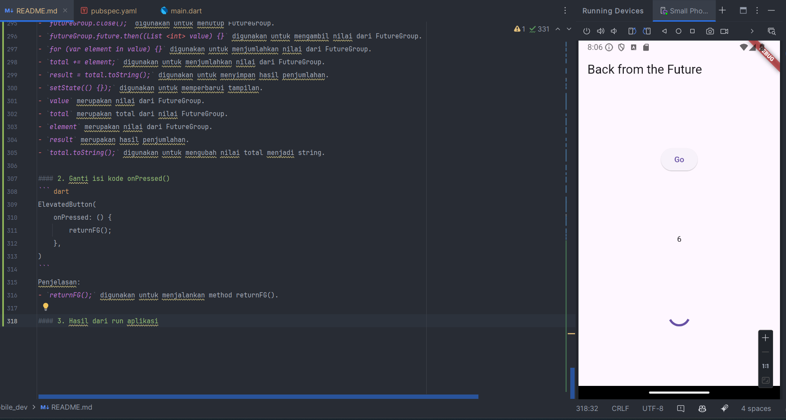

``` text
Nama   : Muhammad Fakhruddin Arif
NIM    : 2241720030
Kelas  : TI-3C
```
### Praktikum 1
#### 1. Menambah package http pada flutter
``` bash
flutter pub add http
```
Penjelasan:
- `flutter pub add` digunakan untuk menambahkan package pada flutter.

Berikut adalah hasil dari penambahan package http pada flutter:


#### 2. Cek file pubspec.yaml


#### 3. Buat file main.dart
``` dart
void main() => runApp(const MyApp());

class MyApp extends StatelessWidget {
  const MyApp({Key? key}) : super(key: key);

  @override
  Widget build(BuildContext context) {
    return MaterialApp(
      title: 'Future Demo - Muhammad Fakhruddin Arif',
      theme: ThemeData(
        primarySwatch: Colors.blue,
        visualDensity: VisualDensity.adaptivePlatformDensity,
      ),
      home: const FuturePage(),
    );
  }
}

class FuturePage extends StatefulWidget {
  const FuturePage({Key? key}) : super(key: key);

  @override
  _FuturePageState createState() => _FuturePageState();
}

class _FuturePageState extends State<FuturePage> {
  String result = '';

  @override
  Widget build(BuildContext context) {
    return Scaffold(
      appBar: AppBar(
        title: const Text('Back from the Future'),
      ),
      body: Center(
        child: Column(
          children: [
            const Spacer(),
            ElevatedButton(onPressed: () {}, child: const Text('Go')),
            const Spacer(),
            Text(result),
            const Spacer(),
            const CircularProgressIndicator(),
            const Spacer(),
          ],
        ),
      ),
    );
  }
}
```
Penjelasan:
- `void main() => runApp(const MyApp());` digunakan untuk menjalankan aplikasi.
- `class MyApp extends StatelessWidget` merupakan class yang berfungsi sebagai tampilan utama aplikasi.
- `class FuturePage extends StatefulWidget` merupakan class yang berfungsi sebagai tampilan halaman Future.
- `String result = '';` digunakan untuk menyimpan hasil dari Future.
- `ElevatedButton(onPressed: () {}, child: const Text('Go'))` digunakan untuk membuat tombol Go.
- `Text(result)` digunakan untuk menampilkan hasil dari Future.
- `CircularProgressIndicator()` digunakan untuk menampilkan loading.
- Spacer() digunakan untuk memberikan jarak antar widget.

#### 4. Tambah method getData()
``` dart
  Future<Response> getData() async {
    const authority = 'www.googleapis.com';
    const path = '/books/v1/volumes/1bm0DwAAQBAJ';
    return get(Uri.https(authority, path));
  }
```
Penjelasan:
- `Future<Response> getData() async` merupakan method yang digunakan untuk mengambil data dari API.
- `const authority = 'www.googleapis.com
- `const path = '/books/v1/volumes/1bm0DwAAQBAJ'` merupakan path dari API yang akan diambil.
- `return get(Uri.https(authority, path));` digunakan untuk mengambil data dari API.

Hasil dari penambahan method getData():


#### 5. Tambah kode di ElevatedButton
``` dart
ElevatedButton(
    onPressed: () {
        setState(() {});
        getData().then((value) {
            result = value.body.toString().substring(0, 450);
            setState(() {});
        }).catchError((_) {
            result = 'An error occurred';
            setState(() {});
        });
    },
child: const Text('Go')),
```
Penjelasan:
- `setState(() {});` digunakan untuk memperbarui tampilan.
- `getData().then((value) {}` digunakan untuk mengambil data dari API.
- `result = value.body.toString().substring(0, 450);` digunakan untuk menyimpan hasil dari API.
- `result = 'An error occurred';` digunakan untuk menampilkan pesan error.
- substring(0, 450) digunakan untuk membatasi jumlah karakter yang ditampilkan.
- catchError((_) digunakan untuk menangani error.

Hasil dari run aplikasi:


### Praktikum 2
#### 1. Buka file main.dart
``` dart
Future<int> returnOneAsync() async {
  await Future.delayed(const Duration(seconds: 3));
  return 1;
}

Future<int> returnTwoAsync() async {
  await Future.delayed(const Duration(seconds: 3));
  return 2;
}

Future<int> returnThreeAsync() async {
  await Future.delayed(const Duration(seconds: 3));
  return 3;
}
```
Penjelasan:
- `Future<int> returnOneAsync() async` merupakan method yang digunakan untuk mengembalikan nilai 1 setelah 3 detik.
- `Future<int> returnTwoAsync() async` merupakan method yang digunakan untuk mengembalikan nilai 2 setelah 3 detik.
- `Future<int> returnThreeAsync() async` merupakan method yang digunakan untuk mengembalikan nilai 3 setelah 3 detik.

#### 2. Tambah method count()
``` dart
Future count() async {
    int total = 0;
    total += await returnOneAsync();
    total += await returnTwoAsync();
    total += await returnThreeAsync();
    setState(() {
      result = total.toString();
    });
  }
```
Penjelasan:
- `Future count() async` merupakan method yang digunakan untuk menjumlahkan nilai dari method returnOneAsync(), returnTwoAsync(), dan returnThreeAsync().

#### 3. Panggil method count() di ElevatedButton
``` dart
ElevatedButton(
    onPressed: () {
        count();
    },
child: const Text('Go')),
```
Penjelasan:
- `count();` digunakan untuk menjalankan method count().

#### 4. Hasil dari run aplikasi


### Praktikum 3
#### 1. Buka file main.dart
``` dart
import 'package:async/async.dart';
```
Penjelasan:
- `import 'package:async/async.dart';` digunakan untuk mengimport package async.

#### 2. Tambah variabel dan method
``` dart
late Completer completer;

  Future getNumber() {
    completer = Completer<int>();
    calculate();
    return completer.future;
  }

  Future calculate() async {
    await Future.delayed(const Duration(seconds : 5));
    completer.complete(42);
  }
```
Penjelasan:
- `late Completer completer;` digunakan untuk membuat variabel completer.
- `Future getNumber()` merupakan method yang digunakan untuk mengembalikan nilai dari method calculate().
- `completer = Completer<int>();` digunakan untuk membuat completer.
- `calculate();` digunakan untuk menjalankan method calculate().
- `completer.complete(42);` digunakan untuk mengembalikan nilai 42 setelah 5 detik.
- `await Future.delayed(const Duration(seconds : 5));` digunakan untuk menunda eksekusi selama 5 detik.

#### 3. Ganti isi kode onPressed()
``` dart
ElevatedButton(
    onPressed: () {
        getNumber().then((value) {
            setState(() {
              result = value.toString();
           });
        });
    },
)
```
Penjelasan:
- `getNumber().then((value) {}` digunakan untuk mengambil nilai dari method getNumber().
- `result = value.toString();` digunakan untuk menyimpan nilai dari method getNumber().
- `setState(() {});` digunakan untuk memperbarui tampilan.
- `value.toString();` digunakan untuk mengubah nilai menjadi string.
- `result = value.toString();` digunakan untuk menyimpan nilai dari method getNumber().

#### 4. Hasil dari run aplikasi


#### 5. Ganti method calculate()
``` dart
Future calculate2() async {
    try {
      await Future.delayed(const Duration(seconds: 5));
      completer.complete(42);
    } catch (_) {
      completer.completeError({});
    }
  }
```
Penjelasan:
- `Future calculate2() async` merupakan method yang digunakan untuk mengembalikan nilai 42 setelah 5 detik.
- `completer.completeError({});` digunakan untuk menampilkan pesan error.
- `await Future.delayed(const Duration(seconds: 5));` digunakan untuk menunda eksekusi selama 5 detik.
- `completer.complete(42);` digunakan untuk mengembalikan nilai 42 setelah 5 detik.

#### 6. Pindah ke onPressed()
``` dart
getNumber().then((value) {
  setState(() {
    result = value.toString();
  });
}).catchError((e) {
  result = 'An error occurred';
});
```
Penjelasan:
- `getNumber().then((value) {}` digunakan untuk mengambil nilai dari method getNumber().
- `result = value.toString();` digunakan untuk menyimpan nilai dari method getNumber().
- `setState(() {});` digunakan untuk memperbarui tampilan.
- `value.toString();` digunakan untuk mengubah nilai menjadi string.
- Perbedaan dengan langkah 2 adalah penambahan `catchError((e) {}` untuk menangani error. Ketika terjadi error, maka akan menampilkan pesan 'An error occurred'.

Hasil dari run aplikasi:


### Praktikum 4
#### 1. Buka file main.dart
``` dart
void returnFG() {
    FutureGroup<int> futureGroup = FutureGroup<int>();
    futureGroup.add(returnOneAsync());
    futureGroup.add(returnTwoAsync());
    futureGroup.add(returnThreeAsync());
    futureGroup.close();
    futureGroup.future.then((List <int> value) {
      int total = 0;
      for (var element in value) {
        total += element;

      }
      setState(() {
        result = total.toString();
      });
    });
  }
```
Penjelasan:
- `void returnFG()` merupakan method yang digunakan untuk menjumlahkan nilai dari method returnOneAsync(), returnTwoAsync(), dan returnThreeAsync().
- `FutureGroup<int> futureGroup = FutureGroup<int>();` digunakan untuk membuat FutureGroup.
- `futureGroup.add(returnOneAsync()); adalah method untuk menambahkan returnOneAsync() ke FutureGroup.
- `futureGroup.add(returnTwoAsync()); adalah method untuk menambahkan returnTwoAsync() ke FutureGroup.
- `futureGroup.add(returnThreeAsync()); adalah method untuk menambahkan returnThreeAsync() ke FutureGroup.
- `futureGroup.close();` digunakan untuk menutup FutureGroup.
- `futureGroup.future.then((List <int> value) {}` digunakan untuk mengambil nilai dari FutureGroup.
- `for (var element in value) {}` digunakan untuk menjumlahkan nilai dari FutureGroup.
- `total += element;` digunakan untuk menjumlahkan nilai dari FutureGroup.
- `result = total.toString();` digunakan untuk menyimpan hasil penjumlahan.
- `setState(() {});` digunakan untuk memperbarui tampilan.
- `value` merupakan nilai dari FutureGroup.
- `total` merupakan total dari nilai FutureGroup.
- `element` merupakan nilai dari FutureGroup.
- `result` merupakan hasil penjumlahan.
- `total.toString();` digunakan untuk mengubah nilai total menjadi string.

#### 2. Ganti isi kode onPressed()
``` dart
ElevatedButton(
    onPressed: () {
        returnFG();
    },
)
```
Penjelasan:
- `returnFG();` digunakan untuk menjalankan method returnFG().

#### 3. Hasil dari run aplikasi


#### 4. Ganti variabel futureGroup
``` dart
final futures = Future.wait<int>([
      returnOneAsync(),
      returnTwoAsync(),
      returnThreeAsync(),
    ]);
    futures.then((List <int> value) {
      int total = 0;
      for (var element in value) {
        total += element;

      }
      setState(() {
        result = total.toString();
      });
    });
```
Penjelasan:
- `final futures = Future.wait<int>([]);` digunakan untuk membuat Future.wait.
- `returnOneAsync(), returnTwoAsync(), returnThreeAsync()`
- `futures.then((List <int> value) {}` digunakan untuk mengambil nilai dari Future.wait.
- Perbedaan dengan langkah 1 adalah penggunaan Future.wait untuk menggantikan FutureGroup. Dan tidak perlu menutup Future.wait.

### Praktikum 5
#### 1. Buka file main.dart
``` dart
Future returnError() async {
    await Future.delayed(const Duration(seconds: 2));
    throw Exception('Something terrible happened!');
  }
```
Penjelasan:
- `Future returnError() async` merupakan method yang digunakan untuk menampilkan pesan error setelah 2 detik.

#### 2. Ganti ElevatedButton onPressed()
``` dart
returnError().then((value) {
                    setState(() {
                      result = "Success";
                    });
                  }).catchError((e) {
                    setState(() {
                      result = e.toString();
                    });
                  }).whenComplete(() {
                    print('Complete');
                  });
```
Penjelasan:
- `returnError().then((value) {}` digunakan untuk menampilkan pesan 'Success' ketika berhasil.
- `result = "Success";` digunakan untuk menyimpan pesan 'Success'.
- `setState(() {});` digunakan untuk memperbarui tampilan.
- `value` merupakan nilai dari method returnError().
- `result` merupakan pesan yang akan ditampilkan.
- `result = e.toString();` digunakan untuk menyimpan pesan error.
- `e` merupakan pesan error.
- `e.toString();` digunakan untuk mengubah pesan error menjadi string.
- `catchError((e) {}` digunakan untuk menangani error.
- `whenComplete(() {}` digunakan untuk menampilkan pesan 'Complete' ketika selesai.

#### 3. Hasil dari run aplikasi


#### 4. Tambah method handleError()
``` dart
Future handleError() async {
    try {
      await returnError();
    } catch (error) {
      setState(() {
        result = error.toString();
      });
    }
    finally {
      print('Complete');
    }
  }
```
Penjelasan:
- `Future handleError() async` merupakan method yang digunakan untuk menampilkan pesan error.
- `try {}` digunakan untuk mencoba menjalankan method returnError().
- `catch (error
- `setState(() {});` digunakan untuk memperbarui tampilan.
- `result = error.toString();` digunakan untuk menyimpan pesan error.
- `error` merupakan pesan error.
- `error.toString();` digunakan untuk mengubah pesan error menjadi string.
- `finally {}` digunakan untuk menampilkan pesan 'Complete' ketika selesai.
- `print('Complete');` digunakan untuk menampilkan pesan 'Complete'.

#### Soal 10
- Perbedaan antara langkah 1 dan langkah 4 adalah pada langkah 1 menggunakan `throw Exception('Something terrible happened!');` sedangkan pada langkah 4 menggunakan `try {} catch (error) {} finally {}`.

Hasil dari run aplikasi:


### Praktikum 6
#### 1. Install plugin geolocator
``` bash
flutter pub add geolocator
```

#### 2. Tambah permission gps
``` xml
<uses-permission android:name="android.permission.ACCESS_FINE_LOCATION"/>
<uses-permission android:name="android.permission.ACCESS_COARSE_LOCATION"/>
```

#### Soal 11
``` dart
appBar: AppBar(
        title: const Text('Current Location Arif'),
      ),
```
Hasil dari run aplikasi:


#### 3. Tambahkan animasi loading
``` dart
Widget build(BuildContext context) {
    final myWidget = myPosition == '' ? CircularProgressIndicator() : Text(myPosition);

    return Scaffold(
      appBar: AppBar(
        title: const Text('Current Location Arif'),
      ),
      body: Center(
        child: myWidget,
      ),
    );
  }
```
Penjelasan:
- `final myWidget = myPosition == '' ? CircularProgressIndicator() : Text(myPosition
- `myPosition == ''` digunakan untuk mengecek apakah myPosition kosong.
- `CircularProgressIndicator()` digunakan untuk menampilkan loading.
- `Text(myPosition)` digunakan untuk menampilkan myPosition.
- `myPosition` merupakan posisi saat ini.
- `Center()` digunakan untuk membuat widget berada di tengah.
- `myWidget` merupakan widget yang akan ditampilkan.

Hasil dari run aplikasi:


#### Soal 12
- Apakah Anda mendapatkan koordinat GPS ketika run di browser? Mengapa demikian?
  - Iya, karena browser mendukung geolocation.

### Praktikum 7
#### Soal 13
- Apakah ada perbedaan UI dengan praktikum sebelumnya? Mengapa demikian?
  - Ada, Tetapi hanya pada tampilan atau letak tulisan saja

#### Soal 14
- Apakah ada perbedaan UI dengan langkah sebelumnya? Mengapa demikian?
  - Tidak terdapat perbedaan UI dengan langkah sebelumnya.

### Praktikum 8
#### Soal 15
- Tambahkan nama panggilan Anda pada tiap properti title sebagai identitas pekerjaan Anda.
``` dart
appBar: AppBar(
title: const Text('Navigation First Screen Arif'),
),
```
- Silakan ganti dengan warna tema favorit Anda.
``` dart
  Color color = Colors.pinkAccent;
```
#### Soal 16
- Cobalah klik setiap button, apa yang terjadi ? Mengapa demikian ?
  - Ketika button di klik, maka akan berpindah ke halaman lain. Hal ini terjadi karena button tersebut memiliki fungsi untuk berpindah ke halaman lain.

Berikut hasil dari run aplikasi:


### Praktikum 9
#### Soal 17
- Cobalah klik setiap button, apa yang terjadi ? Mengapa demikian ?
  - Ketika button di klik, maka akan berpindah ke halaman lain. Hal ini terjadi karena button tersebut memiliki fungsi untuk berpindah ke halaman lain seperti sebelumnya.

Berikut hasil dari run aplikasi:
