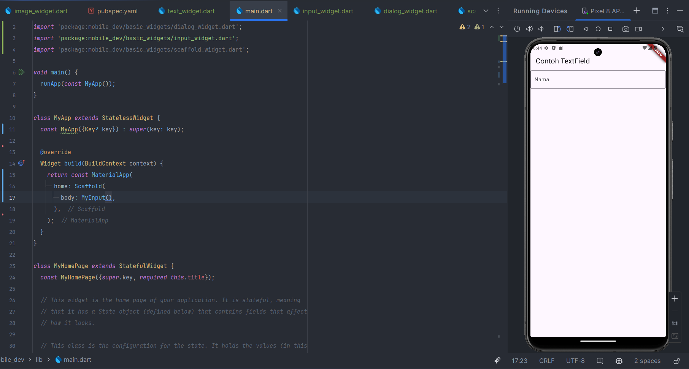

``` text
Nama   : Muhammad Fakhruddin Arif
NIM    : 2241720030
Kelas  : TI-3C
```
### Praktikum 1
#### 1. Membuat project Flutter Langkah 1

#### 2. Membuat project Flutter Langkah 2

#### 3. Membuat project Flutter Langkah 3

#### 4. Membuat project Flutter Langkah 4


### Praktikum 2
#### 1. Membuat repository baru

#### 2. Tampilan awal repository

#### 3. Membuat git init

#### 4. Membuat git add

#### 5. Membuat git commit

#### 6. Push ke repository

#### 7 dan 8. Tambahkan remote repository ke local repository

#### 9. Push .gitignore

#### 10. Push project flutter

#### 11. Run project flutter

#### 12. Membuat teks dengan nama lengkap


### Praktikum 3
#### 1. Membuat text widget

#### 2. Image Widget


### Praktikum 4
#### 1. Cupertino Button dan Loading Bar
``` dart
import 'package:flutter/cupertino.dart';
import 'package:flutter/material.dart';

class MyLoadingCupertino extends StatelessWidget {
  const MyLoadingCupertino({Key? key}) : super(key: key);

  @override
  Widget build(BuildContext context) {
    return MaterialApp(
      home: Container(
        margin: const EdgeInsets.only(top: 30),
        color: Colors.white,
        child: Column(
          children: <Widget>[
            CupertinoButton(
              child: const Text("Contoh button"),
              onPressed: () {},
            ),
            const CupertinoActivityIndicator(),
          ],
        ),
      ),
    );
  }
}
```
#### 2. Floating Action Button (FAB)
``` dart
import 'package:flutter/material.dart';

class MyFabWidget extends StatelessWidget {
  const MyFabWidget({Key? key}) : super(key: key);

  @override
  Widget build(BuildContext context) {
    return Scaffold(
      floatingActionButton: FloatingActionButton(
        onPressed: () {
          // Add your onPressed code here!
        },
        child: const Icon(Icons.thumb_up),
        backgroundColor: Colors.pink,
      ),
    );
  }
}
```
#### 3. Scaffold Widget

#### 4. Dialog Widget

#### 5. Input dan Selection Widget

#### 6. Date and Time Pickers


### Codelabs: Your First Flutter App
