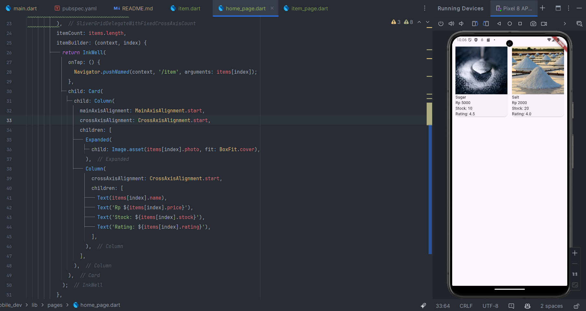

``` text
Nama   : Muhammad Fakhruddin Arif
NIM    : 2241720030
Kelas  : TI-3C
```
### Praktikum 1: Membangun Layout di Flutter
#### 1. File main.dart, Isilah dengan nama dan NIM anda pada text title
```dart
  Widget build(BuildContext context) {
    return MaterialApp(
      title: 'Flutter layout: Muhammad Fakhruddin Arif dan 2241720030',
      home: Scaffold(
        appBar: AppBar(
          title: const Text('Flutter layout demo'),
        ),
        body: const Center(
          child: Text('Hello World'),
        ),
      ),
    );
  }
```
Berikut adalah hasil dari kode diatas:


#### 2. Implementasi title row
``` dart
Widget titleSection = Container(
  padding: const EdgeInsets.all(32),
  child: Row(
    children: [
      Expanded(
        /* soal 1*/
        child: Column(
          crossAxisAlignment: CrossAxisAlignment.start,
          children: [
            /* soal 2*/
            Container(
              padding: const EdgeInsets.only(bottom: 8),
              child: const Text(
                'Wisata Gunung di Batu',
                style: TextStyle(
                  fontWeight: FontWeight.bold,
                ),
              ),
            ),
            Text(
              'Batu, Malang, Indonesia',
              style: TextStyle(
                color: Colors.grey,
              ),
            ),
          ],
        ),
      ),
      /* soal 3*/
      Icon(
        Icons.star,
        color: Colors.red,
      ),
      const Text("41"),
    ],
  ),
);
```
Berikut adalah hasil dari kode diatas:


### Praktikum 2: Implementasi button Row
#### 1. Buat Method Column _buildButtonColumn
``` dart
  Column _buildButtonColumn(Color color, IconData icon, String label) {
    return Column(
      mainAxisSize: MainAxisSize.min,
      mainAxisAlignment: MainAxisAlignment.center,
      children: [
        Icon(icon, color: color),
        Container(
          margin: const EdgeInsets.only(top: 8),
          child: Text(
            label,
            style: TextStyle(
              fontSize: 12,
              fontWeight: FontWeight.w400,
              color: color,
            ),
          ),
        ),
      ],
    );
  }
```
#### 2. Buat widget buttonSection
``` dart
Widget buttonSection (Color color) => Row(
  mainAxisAlignment: MainAxisAlignment.spaceEvenly,
  children: [
    _buildButtonColumn(color, Icons.call, 'CALL'),
    _buildButtonColumn(color, Icons.near_me, 'ROUTE'),
    _buildButtonColumn(color, Icons.share, 'SHARE'),
  ],
);
```
#### 3. Tambah Section buttonSection pada body
``` dart
class MyApp extends StatelessWidget {
  const MyApp({Key? key}) : super(key: key);

  @override
  Widget build(BuildContext context) {
    Color color = Theme.of(context).primaryColor;
    return MaterialApp(
      title: 'Flutter layout: Muhammad Fakhruddin Arif dan 2241720030',
      home: Scaffold(
        appBar: AppBar(
          title: const Text('Flutter layout demo'),
        ),
        body: Column(
          children: [
            titleSection,
            buttonSection(color),
          ],
        )
      ),
    );
  }
}
```
Berikut adalah hasil dari kode diatas:


### Praktikum 3: Implementasi text section
#### 1. Buat widget textSection
``` dart
Widget textSection = Container(
  padding: const EdgeInsets.all(32),
  child: const Text(
    "Gunung Bromo adalah salah satu destinasi wisata paling populer di Indonesia, terutama bagi para pecinta alam dan fotografi."
    " Muhammad Fakhruddin Arif | 2241720030."
        " Selamat mengerjakan 🙂.",
    softWrap: true,
  ),
);
```
#### 2. Tambah Section textSection pada body
``` dart
class MyApp extends StatelessWidget {
  const MyApp({Key? key}) : super(key: key);

  @override
  Widget build(BuildContext context) {
    Color color = Theme.of(context).primaryColor;
    return MaterialApp(
      title: 'Flutter layout: Muhammad Fakhruddin Arif dan 2241720030',
      home: Scaffold(
        appBar: AppBar(
          title: const Text('Flutter layout demo'),
        ),
        body: Column(
          children: [
            titleSection,
            buttonSection(color),
            textSection,
          ],
        )
      ),
    );
  }
}
```
Berikut adalah hasil dari kode diatas:


### Praktikum 4: Implementasi image section
#### 1. Siapkan asset gambar

#### 2. Tambahkan gambar ke body
``` dart
class MyApp extends StatelessWidget {
  const MyApp({Key? key}) : super(key: key);

  @override
  Widget build(BuildContext context) {
    Color color = Theme.of(context).primaryColor;
    return MaterialApp(
      title: 'Flutter layout: Muhammad Fakhruddin Arif dan 2241720030',
      home: Scaffold(
        appBar: AppBar(
          title: const Text('Flutter layout demo'),
        ),
        body: Column(
          children: [
            Image.asset('assets/images/bromo.jpg', width: 600, height: 240, fit: BoxFit.cover,),
            titleSection,
            buttonSection(color),
            textSection,
          ],
        )
      ),
    );
  }
}
```
Berikut adalah hasil dari kode diatas:


#### 3. Ubah menjadi ListView
``` dart
class MyApp extends StatelessWidget {
  const MyApp({Key? key}) : super(key: key);

  @override
  Widget build(BuildContext context) {
    Color color = Theme.of(context).primaryColor;
    return MaterialApp(
      title: 'Flutter layout: Muhammad Fakhruddin Arif dan 2241720030',
      home: Scaffold(
        appBar: AppBar(
          title: const Text('Flutter layout demo'),
        ),
        body: ListView(
          children: [
            Image.asset('assets/images/bromo.jpg', width: 600, height: 240, fit: BoxFit.cover,),
            titleSection,
            buttonSection(color),
            textSection,
          ],
        )
      ),
    );
  }
}
```
Berikut adalah hasil dari kode diatas:


### Praktikum 5: Membangun Navigasi di Flutter
#### 1. Siapkan Folder

#### 2. Mendefinisikan route
##### Home Page
``` dart
import 'package:flutter/material.dart';

class HomePage extends StatelessWidget {
  @override
  Widget build(BuildContext context) {
    throw UnimplementedError();
  }
}
```
##### Item Page
``` dart
import 'package:flutter/material.dart';

class ItemPage extends StatelessWidget {
  @override
  Widget build(BuildContext context) {
    throw UnimplementedError();
  }
}
```
throw UnimplementedError(); adalah pernyataan yang melemparkan sebuah error yang menunjukkan bahwa method build belum diimplementasikan. Ini biasanya digunakan sebagai placeholder untuk menunjukkan bahwa implementasi method ini belum selesai. Secara keseluruhan, kode ini mendefinisikan sebuah widget ItemPage dan HomePage yang belum diimplementasikan sepenuhnya. Method build yang seharusnya mengembalikan tampilan widget masih melemparkan UnimplementedError, yang berarti bahwa tampilan untuk ItemPage dan HomePage belum ditentukan.
#### 3. Lengkapi kode main.dart
``` dart
initialRoute: '/',
routes: {
    '/': (context) => HomePage(),
    '/home': (context) => ItemPage(),
},
```
Kode ini mendefinisikan rute awal dan peta rute untuk aplikasi Flutter. initialRoute: '/' menetapkan rute awal aplikasi ke '/', yang berarti aplikasi akan menampilkan HomePage saat pertama kali dijalankan. Peta rute didefinisikan dalam objek routes, yang memetakan string rute ke widget yang sesuai. Rute '/' dipetakan ke HomePage, dan rute '/home' dipetakan ke ItemPage. Ketika aplikasi menavigasi ke rute '/home', ItemPage akan ditampilkan.
#### 4. Membuat data model
``` dart
class Item {
  String name;
  int price;

  Item({required this.name, required this.price});
}
```
Pada kode diatas, kita mendefinisikan sebuah class Item yang memiliki dua properti: name dan price. Properti name adalah string yang menyimpan nama item, sedangkan properti price adalah integer yang menyimpan harga item. Kita juga mendefinisikan sebuah constructor Item yang menerima dua parameter wajib: name dan price.
#### 5. Lengkapi kode di class HomePage
``` dart
final List<Item> items = [
    Item(name: 'Sugar', price: 5000),
    Item(name: 'Salt', price: 2000),
];
```
Kode diatas mendefinisikan sebuah list items yang berisi dua objek Item. Objek Item pertama memiliki nama 'Sugar' dan harga 5000, sedangkan objek Item kedua memiliki nama 'Salt' dan harga 2000.
#### 6. Membuat ListView dan itemBuilder
``` dart
    return Scaffold(
      body: Container(
        margin: EdgeInsets.all(8),
        child: ListView.builder(
          padding: EdgeInsets.all(8),
            itemCount: items.length,
            itemBuilder: (context, index) {
              final item = items[index];
              return Card(
                child: Container(
                  margin: EdgeInsets.all(8),
                  child: Row(
                    children: [
                      Expanded(child: Text(item.name)),
                      Expanded(
                          child: Text(
                            item.price.toString(),
                            textAlign: TextAlign.end,
                          ),
                      ),
                    ],
                  ),
                )
              );
            }
        ),
      ),
    );
```
Kode diatas membuat sebuah ListView.builder yang menampilkan daftar item dalam list items. ListView.builder memiliki dua parameter wajib: itemCount dan itemBuilder. Parameter itemCount menentukan jumlah item yang akan ditampilkan dalam ListView, sedangkan itemBuilder adalah fungsi yang digunakan untuk membuat widget untuk setiap item dalam list. Pada kode diatas, itemBuilder membuat sebuah Card untuk setiap item dalam list items. Card berisi dua widget Text yang menampilkan nama dan harga item. Widget Text yang menampilkan harga diberi properti textAlign: TextAlign.end agar teksnya ditampilkan di sebelah kanan.
#### 7. Menambahkan aksi pada ListView
``` dart
            return InkWell(
                onTap: () {
                  Navigator.pushNamed(context, '/item');
                },
                child: Card(
                  child: Container(
                    margin: EdgeInsets.all(8),
                    child: Row(
                      children: [
                        Expanded(child: Text(item.name)),
                        Expanded(
                            child: Text(
                              item.price.toString(),
                              textAlign: TextAlign.end,
                            ),
                        ),
                      ],
                    ),
                  )
                ),
              );
```
Kode diatas menambahkan sebuah InkWell ke dalam Card yang menampilkan item. InkWell adalah widget yang menambahkan efek interaktif ke dalam widget lain. Pada kode diatas, InkWell diberikan properti onTap yang menavigasikan pengguna ke rute '/item' saat item di-tap. Navigator.pushNamed(context, '/item') digunakan untuk menavigasikan pengguna ke rute '/item'. Kode ini akan menampilkan ItemPage saat item di-tap.

Berikut adalah hasil dari kode diatas:


### Tugas 2
#### 1. Perbarui code navigator
``` dart
        itemBuilder: (context, index) {
              final item = items[index];
              return InkWell(
                onTap: () {
                  Navigator.pushNamed(context, '/item', arguments: item);
                },
                child: Card(
                  child: Container(
                    margin: EdgeInsets.all(8),
                    child: Row(
                      children: [
                        Expanded(child: Text(item.name)),
                        Expanded(
                            child: Text(
                              item.price.toString(),
                              textAlign: TextAlign.end,
                            ),
                        ),
                      ],
                    ),
                  )
                ),
              );
            }
```
Pada kode diatas, kita menambahkan parameter arguments pada Navigator.pushNamed(context, '/item', arguments: item);. Parameter arguments digunakan untuk mengirimkan data item ke ItemPage.
#### 2. Tambahkan kode untuk menampilkan data item
``` dart
import 'package:flutter/material.dart';
import 'package:mobile_dev/models/item.dart';

class ItemPage extends StatelessWidget {
  ItemPage({Key? key}) : super(key: key);
  @override
  Widget build(BuildContext context) {
    final itemArgs = ModalRoute.of(context)!.settings.arguments as Item;
    // throw UnimplementedError();
    return Scaffold(
      appBar: AppBar(
        title: Text('Item ${itemArgs.name}'),
      ),
      body: Center(
        child: Text('Name: ${itemArgs.name} | Price: ${itemArgs.price}'),
      ),
    );
  }
}
```
Pada kode diatas, kita mendapatkan data item yang dikirimkan dari HomePage menggunakan ModalRoute.of(context)!.settings.arguments as Item;. Kode ini mengambil data item dari arguments yang dikirimkan dari HomePage. Data item tersebut kemudian ditampilkan pada AppBar dan body ItemPage.

Berikut adalah hasil dari kode diatas:

#### 3. Modifikasi dengan GridView
``` dart
        GridView.builder(
          gridDelegate: SliverGridDelegateWithFixedCrossAxisCount(
            crossAxisCount: 2,
            crossAxisSpacing: 8,
            mainAxisSpacing: 8,
            childAspectRatio: 0.75,
          ),
          itemCount: items.length,
          itemBuilder: (context, index) {
            return InkWell(
              onTap: () {
                Navigator.pushNamed(context, '/item', arguments: items[index]);
              },
              child: Card(
                child: Column(
                  mainAxisAlignment: MainAxisAlignment.start,
                  crossAxisAlignment: CrossAxisAlignment.start,
                  children: [
                    Expanded(
                      child: Image.asset(items[index].photo, fit: BoxFit.cover),
                    ),
                    Column(
                      crossAxisAlignment: CrossAxisAlignment.start,
                      children: [
                        Text(items[index].name),
                        Text('Rp ${items[index].price}'),
                        Text('Stock: ${items[index].stock}'),
                        Text('Rating: ${items[index].rating}'),
                      ],
                    ),
                  ],
                ),
              ),
            );
          },
        ),
```
Pada kode diatas, kita mengubah ListView.builder menjadi GridView.builder. GridView.builder memiliki properti gridDelegate yang menentukan tata letak grid. SliverGridDelegateWithFixedCrossAxisCount
digunakan untuk membuat grid dengan jumlah kolom tetap. Pada kode diatas, kita membuat grid dengan dua kolom menggunakan crossAxisCount: 2. Kita juga menentukan jarak antar kolom dan baris menggunakan crossAxisSpacing dan mainAxisSpacing. childAspectRatio
digunakan untuk menentukan rasio aspek widget dalam grid. Pada kode diatas, kita menetapkan childAspectRatio: 0.75, yang berarti lebar widget dua kali lipat tingginya. Kita juga mengubah tampilan item dalam grid menjadi Card yang berisi gambar, nama, harga, stok, dan rating item.

Berikut adalah hasil dari kode diatas:


Dan berikut adalah hasil dari kode diatas pada item page:

#### 4. Hero Widget
``` dart
child: Hero(
  tag: items[index].name,
  child: Image.asset(items[index].photo, fit: BoxFit.cover),
),
```
Berikut adalah hasil dari kode diatas:


#### 5. Menambah footer nama dan nim
``` dart
Widget footerSection = Container(
  padding: const EdgeInsets.all(16),
  child: const Text(
    'Nama: Muhammad Fakhruddin Arif | NIM: 2241720030',
    textAlign: TextAlign.center,
    style: TextStyle(
      fontSize: 16,
      fontWeight: FontWeight.bold,
    ),
  ),
);
```
Berikut adalah hasil dari kode diatas:


#### 6. Navigasi dan route go_router
home_page.dart
``` dart
onTap: () {
    context.go('/item', extra: items[index]);
},
```
item_page.dart
``` dart
final itemArgs = context.extra as Item;

appBar: AppBar(
    title: Row(
    children: [
        IconButton(onPressed: () {
        GoRouter.of(context).go('/');
        }, icon: Icon(Icons.arrow_back)),
        Text(itemArgs.name),
    ],
   ),
),
```
main.dart
``` dart
final GoRouter _router = GoRouter(
  initialLocation: '/',
  routes: [
    GoRoute(
      path: '/',
      builder: (context, state) => HomePage(),
    ),
    GoRoute(
      path: '/item',
      builder: (context, state) => ItemPage(),
    ),
  ],
);

class MyApp extends StatelessWidget {
  const MyApp({Key? key}) : super(key: key);

  @override
  Widget build(BuildContext context) {
    return MaterialApp.router(
      title: 'Flutter layout: Muhammad Fakhruddin Arif dan 2241720030',
      routerDelegate: _router.routerDelegate,
      routeInformationParser: _router.routeInformationParser,
    );
  }
}
```
Berikut adalah hasil dari kode diatas:


Home Page:


Item Page:
